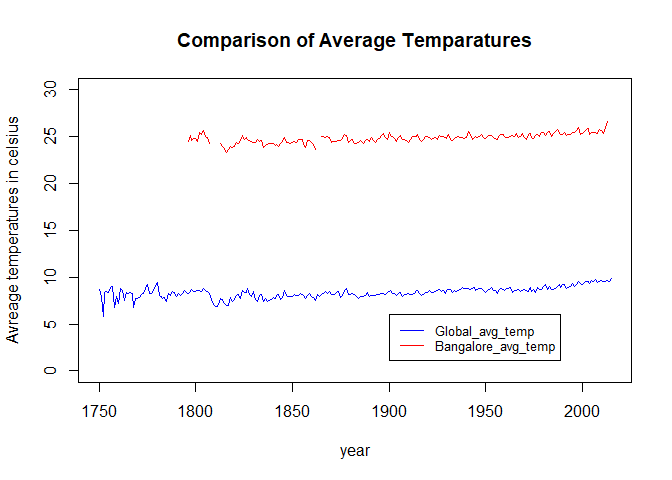
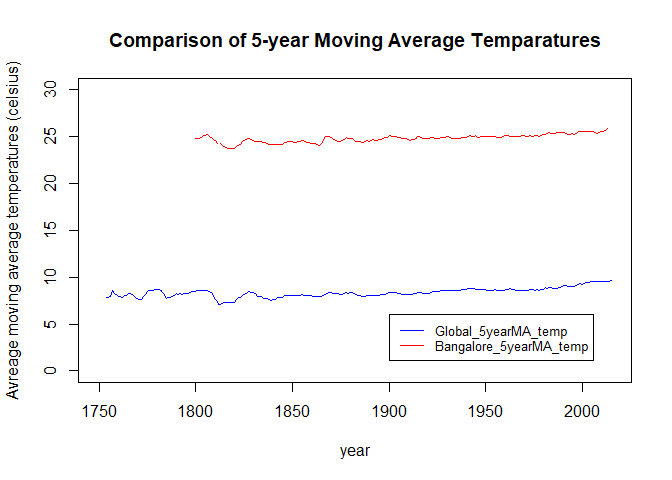
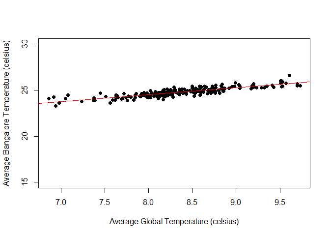
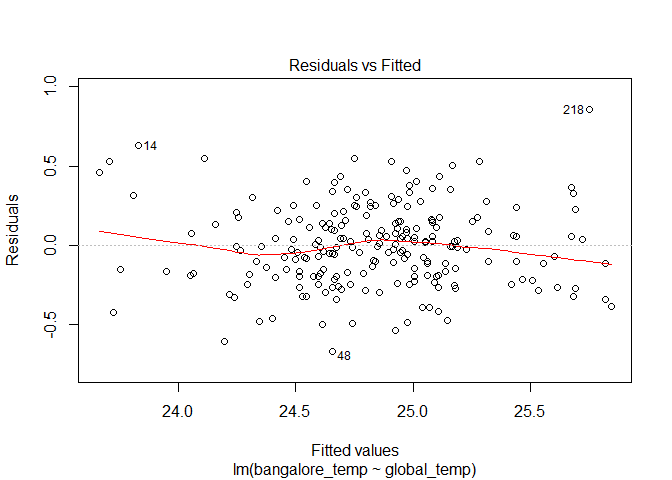
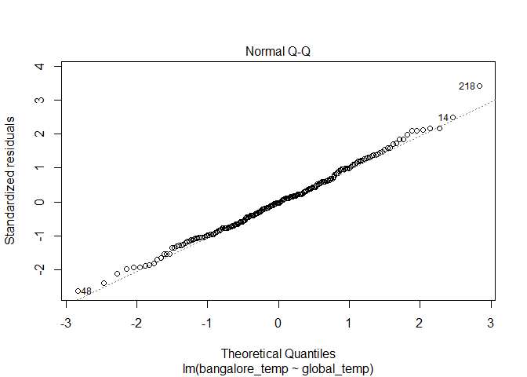
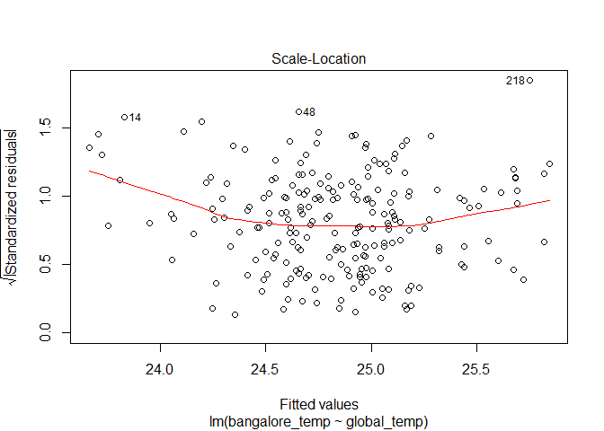
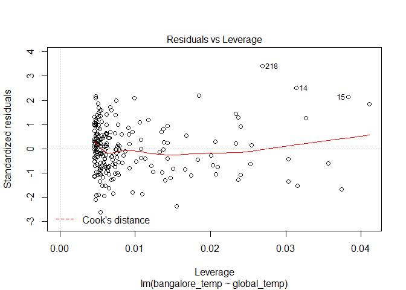

Project 1 - Exploring Weather Trends
================
Lakshmi\_Rajasekhar
September 17, 2017

-   [1. INTRODUCTION](#introduction)
-   [2. APPROACH](#approach)
    -   [2.1. Tools Used](#tools-used)
-   [3. DETAILED STEPS AND ANALYSIS](#detailed-steps-and-analysis)
    -   [3.1. Extraction Of Data From Database](#extraction-of-data-from-database)
    -   [3.2. Basic Exploration Of Data](#basic-exploration-of-data)
    -   [3.3. Covariance and Correlation Coefficients](#covariance-and-correlation-coefficients)
    -   [3.4. Simple Linear Regression Modelling](#simple-linear-regression-modelling)
-   [4. CONCLUSIONS AND FINDINGS](#conclusions-and-findings)

1. INTRODUCTION
---------------

The objective of this study is to compare weather trends, specifically average temperatures, between a city of our choice and global average temperatures. This report details the observations and findings from comparing weather data (average temperatures) for Bangalore city, India with the average global temperatures.

2. APPROACH
-----------

Udacity provided the required data for this analysis. The approach followed in this study is to extract the relevant data out of the database using SQL commands and then save the data as csv files to disk.
Global average temperature data are available from year 1750 - 2015 but Bangalore average temperatures are only available from 1796 to 2013 with few missing values in between. Although all available years for global average temperatures are used for plotting and analysing the raw data, only data for years 1796 - 2013 are used for the detailed study and linear regression model building (detailed in the coming sections).
The following is the general approach for this study:

-   Data extraction
-   Basic data exploration and plotting
-   Detailed analysis, covariance and correlation coefficients
-   Linear regression model building
-   Conclusions and findings

### 2.1. Tools Used

-   SQL
-   Excel
-   R programming (R Studio, Rmarkdown for report creation)

3. DETAILED STEPS AND ANALYSIS
------------------------------

### 3.1. Extraction Of Data From Database

The first step for this study is to extract out the average yearly temperatures for Bangalore and the whole world.
For extracting the average yearly temperatures for Bangalore, the starting point is to find if the given database has data for 'Bangalore'. The database table 'city\_list' provides a list of all cities and countries included in the database. SQL querying is used to check if 'Bangalore' is present in the table 'city\_list' as given below. Wildcards are used for searching for the term 'Bangalore' as Bangalore could be listed as 'Bangalore' or 'Bengaluru' (the new official name).

``` sql
SELECT city, country
FROM city_list
WHERE city LIKE 'B%' AND country LIKE 'India';
```

The above query confirms that data for 'Bangalore' is present in the database. The next step is to extract average yearly temperatures for Bangalore from the table 'city\_data' using the SQL query as given below.

``` sql
SELECT year, avg_temp
FROM city_data
WHERE city = 'Bangalore'
```

The third step is to extract the average global temperatures. This is done using the SQL query given below. The extracted data is exported and saved as csv files to disk.

``` sql
SELECT *
FROM global_data;
```

### 3.2. Basic Exploration Of Data

The extracted data is then imported into R for further analysis.

``` r
# Clear the working environment
rm(list = ls(all = T))

# Read the datasets
bangalore_temp = read.csv("Bangalore_temp.csv", header = T)
global_temp = read.csv("Global_temp.csv", header = T)
```

After importing the data into R as different dataframes, a merge operation is performed to combine the two datasets with "year" as the common/primary column.

``` r
combined_temp = merge(global_temp, bangalore_temp, by = "year", all.x = TRUE)
# Reset the column names
names(combined_temp) = c("year", "global_temp", "bangalore_temp")
```

A raw plot of the data would give us a general understanding of the layout of the whole data. A line plot with year on the x-axis and average temperatures on the y axis for both Bangalore and global is plotted as shown below.

``` r
# Raw data line plot
plot(combined_temp$year, combined_temp$global_temp, type = 'l', col = "blue",xlab = "year", ylab = "Avreage temperatures in celsius", main = "Comparison of Average Temparatures", ylim = c(0,30))
points(combined_temp$year, combined_temp$bangalore_temp, type = 'l', col = "red")
legend(1900,6, legend=c("Global_avg_temp", "Bangalore_avg_temp"),
       col=c("blue", "red"),lty=1, cex=0.8)
```



As can be seen from the above figure, average temperature for Bangalore is consistently much higher than average global temperatures. Bangalore is located at a latitude longitude of 12.9716° N, 77.5946° E which is much closer to the equator than most other cities in the world. Hence, the data confirms the fact that Bangalore is hotter than most other cities of the world (and hence average global temperature).
Another interesting thing to note is that, the average temperatures over the years seems to be increasing at a gradual rate for both Bangalore and worldwide. This confirms that global warming has indeed been happening over the years. To calculate the approximate rate of change, range is calculated for both Bangalore and global average temperatures. From the range, rate of increase is calculated as shown below.

``` r
# Temperature range for Bangalore average temperatures
Bang_range = range(combined_temp$bangalore_temp, na.rm = T)
Bang_rate = (Bang_range[2] - Bang_range[1])/(2013 - 1796)
Bang_rate
```

    ## [1] 0.01525346

``` r
# Temperature range for Global average temperatures
Global_range = range(combined_temp$global_temp, na.rm = T)
Global_rate = (Global_range[2] - Global_range[1])/(2013 - 1796)
Global_rate
```

    ## [1] 0.01866359

As can be seen from the above calculations, both Bangalore and Global average temperatures seem to be increasing at a gradual rate of 1.5% - 2% over the years.
Looking more closely, global average temperatures seem to be increasing at a higher rate at around year 1990 onwards. To investigate this further, rate of temperature increase is computed specifically from year 1990-2013.

``` r
#Tempearute range for Bangalore average temperatures
Bang_range_1990 = range(combined_temp$bangalore_temp[241:264], na.rm = T)
Bang_rate_1990 = (Bang_range_1990[2] - Bang_range_1990[1])/(2013 - 1990)
Bang_rate
```

    ## [1] 0.01525346

``` r
#Tempearute range for Global average temperatures
Global_range_1990 = range(combined_temp$global_temp[241:264], na.rm = T)
Global_rate_1990 = (Global_range_1990[2] - Global_range_1990[1])/(2013 - 1990)
Global_rate_1990
```

    ## [1] 0.03869565

As suspected, Bangalore rate of increase in temperatures over the years is the same whereas the global average temperatures has been increasing at a rate of about 4%! This sudden increase in the rate is a huge concern and cause for alarm for the whole world. The earth as a whole is warming-up at a higher rate since year 1990
A line plot of moving averages would show us the trends without the yearly fluctuations. A 5-year window is chosen for simple moving average calculation as that looks reasonable and not diluting the original data too much. The moving averages are calculated using excel and imported back into R for easiness.

``` r
#Excel file with moving average calculation is imported
movingAverages = read.csv("Temp_MV.csv", header = T)
#Display sample of the imported table
library(knitr)
kable(movingAverages[47:52,-c(6)], caption = "Moving Averages")
```

|     |  year|  World\_Avg\_Temp|  FiveYear\_MA\_World\_Temp|  Bangalore\_Avg\_Temp|  FiveYear\_MA\_Bangalore\_Temp|
|-----|-----:|-----------------:|--------------------------:|---------------------:|------------------------------:|
| 47  |  1796|              8.27|                      8.294|                 24.49|                             NA|
| 48  |  1797|              8.51|                      8.378|                 25.18|                             NA|
| 49  |  1798|              8.67|                      8.466|                 24.65|                             NA|
| 50  |  1799|              8.51|                      8.462|                 24.81|                             NA|
| 51  |  1800|              8.48|                      8.488|                 24.85|                         24.796|
| 52  |  1801|              8.59|                      8.552|                 24.49|                         24.796|

``` r
#Adding the moving averages to the current working dataframe
combined_temp$FiveYearMV_global = movingAverages[,3]
combined_temp$FiveYearMV_bangalore = movingAverages[,5]
```

``` r
#Plotting the 5-year moving-average line graphs
plot(combined_temp$year, combined_temp$FiveYearMV_global, type = 'l', col = "blue",xlab = "year", ylab = "Avreage moving average temperatures (celsius)", main = "Comparison of 5-year Moving Average Temparatures", ylim = c(0,30))
points(combined_temp$year, combined_temp$FiveYearMV_bangalore, type = 'l', col = "red")
legend(1900,6, legend=c("Global_5yearMA_temp", "Bangalore_5yearMA_temp"),
       col=c("blue", "red"),lty=1, cex=0.8)
```



Years 1750 - 1795 and 2014 - 2015 from global average temperatures are excluded from further analysis to make the data consistent for Bangalore and global.

``` r
combined_temp = combined_temp[-c(1:46, 265,266),]
```

The temperature difference between Bangalore and the global average temperature seems to be almost a constant as seen from the 5-year MA line plots.

``` r
#Finding temperature difference
combined_temp$Difference = combined_temp$bangalore_temp - combined_temp$global_temp
rownames(combined_temp) = NULL

library(knitr)
kable(combined_temp[1:6,-c(4,5)], caption = "Temperature Difference")
```

|  year|  global\_temp|  bangalore\_temp|  Difference|
|-----:|-------------:|----------------:|-----------:|
|  1796|          8.27|            24.49|       16.22|
|  1797|          8.51|            25.18|       16.67|
|  1798|          8.67|            24.65|       15.98|
|  1799|          8.51|            24.81|       16.30|
|  1800|          8.48|            24.85|       16.37|
|  1801|          8.59|            24.49|       15.90|

Data for Bangalore is available from year 1796 till 2013 with a few missing values in between. Taking a simple difference between the average temperatures tells us that the average temperature in Bangalore is approximately 16ºC above the average global temperatures.

### 3.3. Covariance and Correlation Coefficients

#### 3.3.1. Missing Values

There are a few missing vales in Banaglore average temperatures as mentioned in the above section. The missing values are imputed before finding the covariance and correlation coefficients.

``` r
# Missing values in Bangalore_temp
sum(is.na(combined_temp$bangalore_temp))
```

    ## [1] 7

``` r
# Missing values in Global_temp
sum(is.na(combined_temp$global_temp))
```

    ## [1] 0

As can be seen from the results above, there are 7 missing values in the yearly average temperatures for Bangalore and none for global temperatures. These missing values has to be imputed before finding the covaraince and correlation coefficients. To make the imputation logically correct, the average temperatures for Bangalore are imputed using a 2-year simple moving average data as shown below.

``` r
library(imputeTS)
combined_temp$bangalore_temp = na.ma(combined_temp$bangalore_temp, 2)
```

#### 3.3.2. Covarinace and Correlation

``` r
# Covarinace
cov(combined_temp$bangalore_temp, combined_temp$global_temp)
```

    ## [1] 0.2287417

The covariance shows that there is a positive relationship between Bangalore average temperatures and global average temperatures. Finding the correlation coefficient would give us the strength of the relationship.

``` r
# Correlation
cor(combined_temp$bangalore_temp, combined_temp$global_temp)
```

    ## [1] 0.8541067

0.8541067 is a highly positive correlation coefficient suggesting that there might be a linear relationship between Bangalore average temperatures and global average temperatures. In other words, yearly global average temperatures can be used to predict the yearly Bangalore average temperatures and vice-versa.

### 3.4. Simple Linear Regression Modelling

From the correlation coefficient, it seems like average temperature in Bangalore can be predicted given the average global temperature for a given year. A simple linear model is build to verify this. Global average temperatures are used to predict the value of Bangalore average temperatures for a given year.

``` r
SLA_model = lm(bangalore_temp ~ global_temp, combined_temp)
summary(SLA_model)
```

    ## 
    ## Call:
    ## lm(formula = bangalore_temp ~ global_temp, data = combined_temp)
    ## 
    ## Residuals:
    ##     Min      1Q  Median      3Q     Max 
    ## -0.6683 -0.1852 -0.0081  0.1554  0.8575 
    ## 
    ## Coefficients:
    ##             Estimate Std. Error t value Pr(>|t|)    
    ## (Intercept) 18.45020    0.26513   69.59   <2e-16 ***
    ## global_temp  0.75986    0.03148   24.14   <2e-16 ***
    ## ---
    ## Signif. codes:  0 '***' 0.001 '**' 0.01 '*' 0.05 '.' 0.1 ' ' 1
    ## 
    ## Residual standard error: 0.2545 on 216 degrees of freedom
    ## Multiple R-squared:  0.7295, Adjusted R-squared:  0.7282 
    ## F-statistic: 582.5 on 1 and 216 DF,  p-value: < 2.2e-16

Both intercept and 'global average temperature' are significant upto 99.9% confidence level. The overall model is also significant (given by the F-statistic). An *R*<sup>2</sup> value of 0.7295 is acceptable enough to continue with this model although there are still un-explained errors in the model.
Hence, the equation for predicting average Bangalore temperatures using average global temperatures is as given below.
*B**a**n**g**a**l**o**r**e* *a**v**g* *t**e**m**p* = 18.45020 + 0.75986 \* *G**l**o**b**a**l* *a**v**g* *t**e**m**p*

Plotting the regression line predicted by the equation above, we have a nice fit as shown below.

``` r
plot(combined_temp$global_temp, combined_temp$bangalore_temp, ylim = c(15,30), ylab = "Average Bangalore Temperature (celsius)", xlab = "Average Global Temperature (celsius)", pch = 16)
abline(SLA_model$coefficients[1], SLA_model$coefficients[2], col = "red")
```



#### 3.4.1 Analysing the Residual Plots

``` r
plot(SLA_model)
```



The residual plots check for the common linear regression assumtions about linearity, normality, heteroscadasticity etc.
The residual plots has few irregularities but good enough to be passed as acceptable. The fourth plot on leverage shows that there are no probable outliers in the dataset considered. Hence, we can conclude that the above linear regression model can be used for predicting the average Bangalore temperatures given average global temperatures for a particular year.

4. CONCLUSIONS AND FINDINGS
---------------------------

The following are the major findings as detailed in the sections above:

1.  Average yearly temperature of Bangalore is higher than average yearly global temperature.
2.  Average temperature of Bangalore is approximately 16 degree celsius hotter than average global temperature every year.
3.  Average yearly temperatures for both Bangalore and global has been increasing gradually (approximately at a rate of 1.5-2%) over the years. This signals that the global warming is indeed true.
4.  The global average temperature increases at a higher rate of approximately 4% after year 1990. The rate of increase of average temperature for Bangalore remains almost the same. Increasing pollution, explosion in global population and increasing deforestation could be causes for the sudden increase in rate of average yearly temperatures.
5.  Bangalore average temperatures are highly correlated with global average temperatures and hence a linear model has been build to predict bangalore average temperature using global average temperature for a given year.
6.  The peaks and truffs in temperatures, over the years in the raw plot, are mostly followed by both Banglore average temperature plot and global average temperature plot.

Data tells stories. Data proves facts. As can be seen from the above analysis, the given weather data helped to make observations about general weather trends as well serious issues like global warming.
