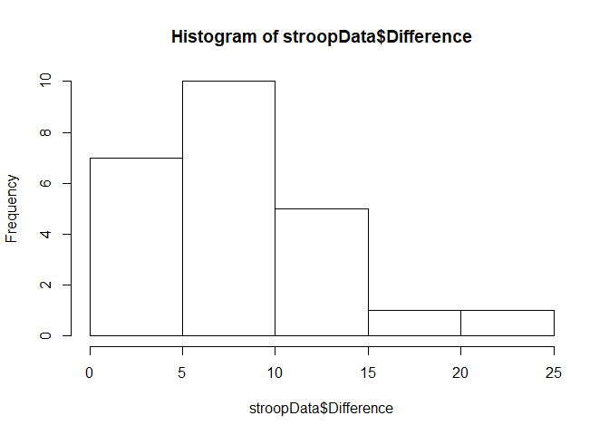
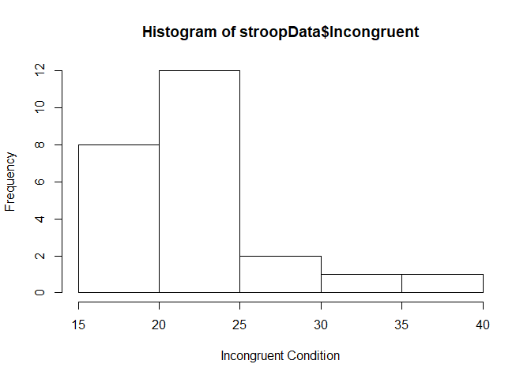
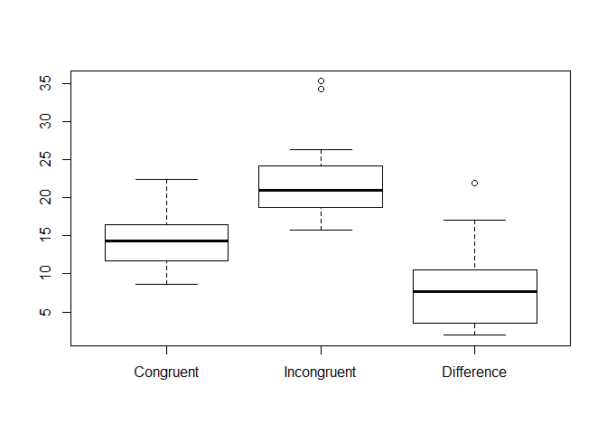
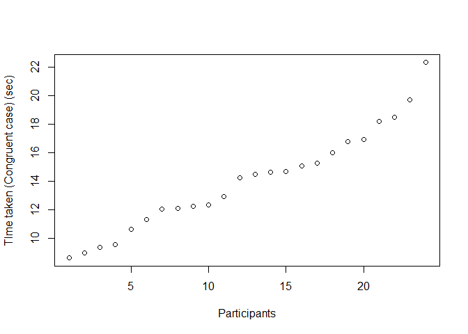
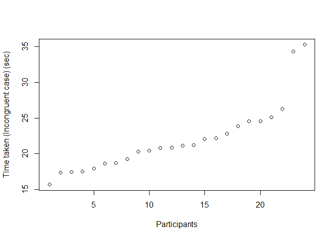
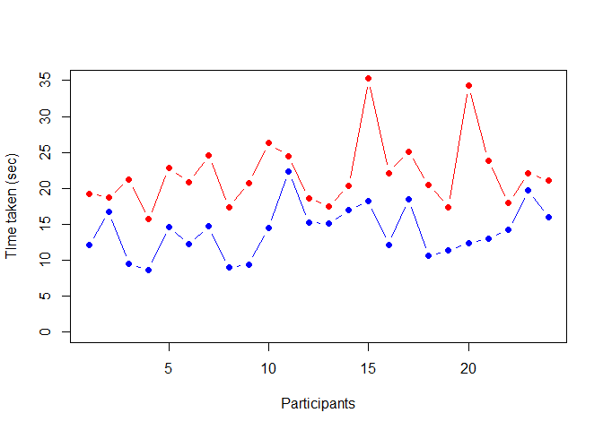

Project 1 - Statistics: The Science of Decisions
================
Lakshmi\_Rajasekhar
October 2, 2017

-   [1. Introduction](#introduction)
-   [2. Background Information Given](#background-information-given)
-   [3. Answers to Questions for Investigation](#answers-to-questions-for-investigation)
    -   [Q1. What is our independent variable? What is our dependent variable?](#q1.-what-is-our-independent-variable-what-is-our-dependent-variable)
    -   [Q2. What is an appropriate set of hypotheses for this task? What kind of statistical test do you expect to perform? Justify your choices.](#q2.-what-is-an-appropriate-set-of-hypotheses-for-this-task-what-kind-of-statistical-test-do-you-expect-to-perform-justify-your-choices.)
    -   [Q3. Report some descriptive statistics regarding this dataset. Include at least one measure of central tendency and at least one measure of variability.](#q3.-report-some-descriptive-statistics-regarding-this-dataset.-include-at-least-one-measure-of-central-tendency-and-at-least-one-measure-of-variability.)
    -   [Q4. Provide one or two visualizations that show the distribution of the sample data. Write one or two sentences noting what you observe about the plot or plots.](#q4.-provide-one-or-two-visualizations-that-show-the-distribution-of-the-sample-data.-write-one-or-two-sentences-noting-what-you-observe-about-the-plot-or-plots.)
    -   [Q5. Now, perform the statistical test and report your results. What is your confidence level and your critical statistic value? Do you reject the null hypothesis or fail to reject it? Come to a conclusion in terms of the experiment task. Did the results match up with your expectations?](#q5.-now-perform-the-statistical-test-and-report-your-results.-what-is-your-confidence-level-and-your-critical-statistic-value-do-you-reject-the-null-hypothesis-or-fail-to-reject-it-come-to-a-conclusion-in-terms-of-the-experiment-task.-did-the-results-match-up-with-your-expectations)
    -   [Q6. Optional: What do you think is responsible for the effects observed? Can you think of an alternative or similar task that would result in a similar effect? Some research about the problem will be helpful for thinking about these two questions!](#q6.-optional-what-do-you-think-is-responsible-for-the-effects-observed-can-you-think-of-an-alternative-or-similar-task-that-would-result-in-a-similar-effect-some-research-about-the-problem-will-be-helpful-for-thinking-about-these-two-questions)
-   [4. References:](#references)

1. Introduction
---------------

The objective of this study is to perform appropriate statistical testing to check if 'Stroop Effect' is true and if the mean time taken by participants to name the ink color for congruent and incongruent words are statistically different.

2. Background Information Given
-------------------------------

The problem statement given is as follows:
In a Stroop task, participants are presented with a list of words, with each word displayed in a color of ink. The participant's task is to say out loud the color of the ink in which the word is printed. The task has two conditions: a congruent words condition, and an incongruent words condition. In the congruent words condition, the words being displayed are color words whose names match the colors in which they are printed: for example RED, BLUE. In the incongruent words condition, the words displayed are color words whose names do not match the colors in which they are printed: for example PURPLE, ORANGE. In each case, we measure the time it takes to name the ink colors in equally-sized lists. Each participant will go through and record a time from each condition.
(Udacity has provided the dataset for this study)

3. Answers to Questions for Investigation
-----------------------------------------

#### Q1. What is our independent variable? What is our dependent variable?

ANS:
There are two conditions - congruent and incongruent words conditions. Both the tasks are presented to a same set of participants.
**Independent Variable:**
The independent variable in this case is the task for the 'Stroop Study' which has two conditions/cases (congruent and incongruent).
A set of participants are shown a list of congruent words (words and ink color are same) and incongruent words (words and ink color are different).
**Dependent Variable:**
The dependent variable is the time taken by participants to name the ink color of the words shown to them for each of the two conditions/tasks.

#### Q2. What is an appropriate set of hypotheses for this task? What kind of statistical test do you expect to perform? Justify your choices.

ANS:
**Hypothesis:**
There are two conditions. In the first condition, participants are shown a list of congruent words with the same ink color as the words. In the second condition, the same list of participants are shown a list of incongruent words with different ink colors than the words. The time taken by each participant to complete the two tasks are noted (to name the ink color of the words shown). Let *μ*<sub>1</sub> be the average time taken by participants (population parameter) to name the ink color of the congruent words. Let *μ*<sub>2</sub> be the average time taken by the participants (again, population average time for incongruent task) to name the ink color of the incongruent words.
In this experiment for stroop test, we do not have any informatiom about the actual population mean response times for the congruent and the incongruent cases. We have two samples with 24 observations each for the congruent and incongruent cases. Using this information, we will do a statistical test to infer if the population mean response times for the two conditions would follow the same inference as shown by the samples.
**Null Hypothesis:**
In the null hypothesis, we state that there is no difference in the mean response times taken by participants to complete the congruent task versus the incongruent task. In other words, null hypothesis states that the mean response times is not dependent on the type of task given (congruent vs incongruent) and hence the mean response times for both the cases would be equal.
**Alternate Hypothesis:**
In the alternate hypothesis, we are trying to see if the type of task (congruent and incongruent cases) has any effect on the mean response times of the participants. Hence, essentially we are testing if the mean response time by participants for the congruent task is different from the mean response time for the incongruent task.
In mathematical terms, null and alternate hypothesis can be written as follows:
*H*<sub>0</sub> : *μ*<sub>1</sub> = *μ*<sub>2</sub>
*H*<sub>*A*</sub> : *μ*<sub>1</sub> ≠ *μ*<sub>2</sub>
Since we are only checking if the means would be different or not, this is a two-tailed test. We are actually infering about the population parameter with the given sample observations.

**NOTE:** With more background information about Stroop Effect, we can actually formulate the alternate hypothesis as the mean time taken for condition two where incongruent words are shown is higher than mean time taken when congruent words are shown. This has to do with how our brains are wired. For now, I will stick to the alternate hypothesis that the means are just different.

**Statistical test:**
Choosing an appropriate statistical test depends on a lot of factors:
1. **Population data distribution:** Since the actual population data distribution is unknown, we assume that the population follows normal distribution.
2. **Sample size:** Generally, we need at least 30 observations for the sample to be considered for a z-test. Since we have only 24 observations, a t-test should be used to do the statistical test.
3. **Population standard deviation:** In this case, nothing is known about the actual population. Since, the standard deviation of the population is not known, again the correct test is t-test.
4. **Which t-test?:** As described earlier, the same set of participants are subjected to the two conditions and hence, it's a paired t-test or a dependent t-test. A paired t-test could be performed to see if the means are significantly different from each other for the two conditions or not.
**Assumptions of paired t-test:**
\* Dependent variable is continuous - true in this case.
\* Observations are independent - this also looks true as none of the sample observations are same.
\* Difference of means should follow approximately normal distribution - this assumption can be tested using a histogram plot of the differences.
\* No outliers - a boxplot would reveal any potential outliers.
To test the last two assumtions, the dataset provided is read in as below:

``` r
stroopData = read.csv("stroopdata.csv", header = TRUE)
```

The difference in the response times for the two condition is found:

``` r
stroopData$Difference = stroopData$Incongruent - stroopData$Congruent
```

A histogram of the difference shows the below:

``` r
hist(stroopData$Difference)
```

 Although this looks right skewed and hence proper normal distribution assumption is not met, real life data fails ideal assumption requirements most of the times. Hence, considering the above plot as approximately normal, we can go ahead with the paired t-test.

A boxplot of the data shows that there is one potential outlier. Since the number of samples is only 24, I am going to keep this observation and continue the analysis. Given the background for stroop effect, we expect to see that the mean response times for the two conditions are not the same. In case the rejection of the null hypothesis happens in a tight manner (the t statistic is very close to the t critical), then I aim to come back and look at this value in more detail.

``` r
boxplot(stroopData$Difference)
```


Assuming all the four assumptions hold true in our case, the following paired t-test statistic can be defined:
***t*<sub>*s**t**a**t**i**s**t**i**c*</sub>:**
$$t\_{statistic}=\\frac{(difference~in~means)}{(Std.~error~in~the~difference~in~means)}=  \\frac{\\mu\_2-\\mu\_1}{(std.~deviation~of~the~difference~of~means/\\sqrt(n))}$$
 where n is the total sample size.

***t*<sub>*c**r**i**t**i**c**a**l*</sub>:**
The critical t would be *t*(*d**f*, *α*) from the t table. Here, degrees of freedom would be 23 as there are 24 observations in total.
The t-test statistic calculated using the above formula would be compared against the t critical obtained from the t-table. If the t-statistic value lies in the critical region, then we reject the null hypothesis and conclude that the mean time taken by the participants for the two conditions (congruent and incongruent) are significantly different and hence Stroop effect is actually true.

#### Q3. Report some descriptive statistics regarding this dataset. Include at least one measure of central tendency and at least one measure of variability.

ANS:

-   Checking the stroopData dataset

``` r
head(stroopData)
```

    ##   Congruent Incongruent Difference
    ## 1    12.079      19.278      7.199
    ## 2    16.791      18.741      1.950
    ## 3     9.564      21.214     11.650
    ## 4     8.630      15.687      7.057
    ## 5    14.669      22.803      8.134
    ## 6    12.238      20.878      8.640

-   Checking the overall summary statistics of the dataset

``` r
summary(stroopData)
```

    ##    Congruent      Incongruent      Difference    
    ##  Min.   : 8.63   Min.   :15.69   Min.   : 1.950  
    ##  1st Qu.:11.90   1st Qu.:18.72   1st Qu.: 3.646  
    ##  Median :14.36   Median :21.02   Median : 7.667  
    ##  Mean   :14.05   Mean   :22.02   Mean   : 7.965  
    ##  3rd Qu.:16.20   3rd Qu.:24.05   3rd Qu.:10.258  
    ##  Max.   :22.33   Max.   :35.26   Max.   :21.919

The summary of the given dataset shows that the minimum time taken by participants for incongruent condition is much higher (15.69 sec) than the congruent condition (8.63 sec). Similarly, the maximum time taken for incongruent condition is also much higher than the congruent case.

**Measures of central tendency:**
**MEAN:**
The mean time taken for congruent case = 14.05 sec The mean time taken for the incongruent case = 22.02 sec (about 8 seconds higher than the congruent case)

**MEDIAN:**
The median time for congruent case = 14.36 sec
(This is pretty close to the mean and hence the congruent sample dataset does not seem to have any significant skewness or outliers). The median time for the incongruent case = 21.02 sec (again, way higher than congruent case for it to be a chance occurance)

A histogram plot would give us a better understanding of the distribution of the data for the two conditions:

-   Histogram for congruent case:

``` r
hist(stroopData$Congruent, xlab = "Congruent Condition")
```


The histogram for the congruent case seems to be almost normal in distribution (neglicing the slight positive skew).

-   Histogram for incongruent case:

``` r
hist(stroopData$Incongruent, xlab = "Incongruent Condition")
```



The histogram for the incongruent case is highly positively skewed denoting that although majority of the participants took around 15-25 sec to name the colors in the incongruent case, there were few cases (2 participants in the current dataset) who took way higher than the mean time to do the task.

**Measures of variability:**
**Range:**
Range is defined as the minimum value subtracted from the maximum value. Range for congruent condition = 22.33 - 8.63 = 13.7 sec
Range for incongruent condition = 35.26 - 15.69 = 19.57 sec
The range for the incongruent case is higher than the congruent case.

**Inter Quartile Range (IQR):**
*I**Q**R* = *Q*<sub>3</sub> − *Q*<sub>1</sub>
 For congruent case,
*I**Q**R*<sub>*c*</sub> = 16.20 − 11.90 = 4.3*s**e**c*

For incongruent case,
*I**Q**R*<sub>*i*</sub> = 24.05 − 18.72 = 5.33*s**e**c*
The IQRs can also be verified using a boxplot

``` r
boxplot(stroopData)
```



The above boxplot for the congruent and the incongruent conditions confirm that incongruent condition has a higher mean time to name the ink color than the congruent condition. Also, except the two potential outliers in the incongruent conditions, rest of the samples falls within 1.5\*IQR range. We would need to collect more samples to confirm if the two observations were outliers or not for the incongruent case.

**Standard Deviation:** One of the best metric to measure variability is 'standrad deviation'. Unlike range, standrad deviation is not affected by outliers and gives us how far away from the population mean our observation is.

Standard deviation for congruent case:

``` r
sd(stroopData$Congruent)
```

    ## [1] 3.559358

Standard deviation for incongruent case:

``` r
sd(stroopData$Incongruent)
```

    ## [1] 4.797057

The standrad deviation values shows that the observations in the incongruent case is much more spread out than the congruent case.
For confidence level of 99 percent, calculating the confidence interval for the incongruent case:

``` r
mean(stroopData$Incongruent) - qnorm(.99)*sd(stroopData$Incongruent)
```

    ## [1] 10.85629

``` r
mean(stroopData$Incongruent) + qnorm(.99)*sd(stroopData$Incongruent)
```

    ## [1] 33.17554

The confidence interval calculation for 99 percent confidence level (*α* = 0.01) shows that the two observations (35.255 and 34.288) do not fall even within the 99% confidence level and hence are very very rare occurance. We will need to take a larger sample of investigate other factors of the participants (like aged participants etc) which could have contributed to a higher time for the task.

#### Q4. Provide one or two visualizations that show the distribution of the sample data. Write one or two sentences noting what you observe about the plot or plots.

ANS:
Question no 3 has some visualizations (boxplots and histograms) which gives us a clear idea about how the dataset is distributed. Apart from that, the below plots also help us to deepen our understanding.

Plotting the time taken by participants in an ascending order, we see that there seems to be three different sections (steps) with different means. One proposition that might hold is that the sample participants are made up of children, adults and old in almost equal proportion. The cognitive and brain processing power for the stroop task might vary with age. Specifically, as people age, the cognition decreases and we might take longer to do the stroop task. (This is just a proposition)

``` r
plot(1:24, sort(stroopData$Congruent), ylab = "TIme taken (Congruent case) (sec)", xlab = "Participants")
```



For the incongruent case, the same effect discussed above seems to be valid. Also, the two datapoints (with time &gt;34sec) seems far apart from the other set of observations.

``` r
plot(1:24, sort(stroopData$Incongruent), ylab = "TIme taken (Incongruent case) (sec)", xlab = "Participants")
```



A basic line plot of both the congruent and incongruent case gives us an idea about how each particpant performed comparitively for the two tasks.

``` r
plot(1:24, stroopData$Congruent, type = "b", ylim = c(0,35), pch = 16, col = "blue", ylab = "TIme taken (sec)", xlab = "Participants")
points(1:24, stroopData$Incongruent, type = "b", pch = 16, col = "red")
```



The two participants who had taken greater than 34 sec for the Incongruent case did not have a higher than usual time taken for the congruent case. This suggests that either the observation might be a typo or there seems to be a higher variation in their brain cognition about how they perform the two tasks.

#### Q5. Now, perform the statistical test and report your results. What is your confidence level and your critical statistic value? Do you reject the null hypothesis or fail to reject it? Come to a conclusion in terms of the experiment task. Did the results match up with your expectations?

ANS:
As stated in Q2, below are the null and alternate hypothesis. It is a paired t-test. Taking the confidence level as 95 percent, *α* = 0.05. Since the alternate hypothesis is only to find if the means are significantly different, it is a two-tailed t-test. The degree of freedom (df) = 23 as there are 24 observations.

**Hypothesis:**
*H*<sub>0</sub> : *μ*<sub>1</sub> = *μ*<sub>2</sub>
*H*<sub>*A*</sub> : *μ*<sub>1</sub> ≠ *μ*<sub>2</sub>

**t\_statistic:**
Calculating the test statistic:
$$t\_{stat}=\\frac{\\mu\_2-\\mu\_1}{(std.~deviation~of~the~difference~of~means/\\sqrt(n))}$$
 Calculating the difference of means:

``` r
stroopData$Difference = stroopData$Incongruent - stroopData$Congruent
head(stroopData)
```

    ##   Congruent Incongruent Difference
    ## 1    12.079      19.278      7.199
    ## 2    16.791      18.741      1.950
    ## 3     9.564      21.214     11.650
    ## 4     8.630      15.687      7.057
    ## 5    14.669      22.803      8.134
    ## 6    12.238      20.878      8.640

Finding the standard deviation of the difference of means:

``` r
sd = sd(stroopData$Difference)
sd
```

    ## [1] 4.864827

$$ t\_{stat} = \\frac{22.02 - 14.05}{4.864827/sqrt(24)} = 8.025952$$

**t\_critical:**
Finding the critical value of t using R base library function qt (same can be found using t-tables also)

``` r
t_critical = qt(p = c(0.025,0.975), df = 23)
t_critical
```

    ## [1] -2.068658  2.068658

**p\_value:**
The p critical value is *α* which is 0.025 on either sides of the t distribution. The p-value using t\_statistic (8.025952) is a lot less than 0.025.

**Conclusion:**
Since the t\_statistics value is way higher than t\_critical value (2.068658), it lies in the critical region (right critical region to be specific). **Hence, we reject the null hypothesis and conclude that the means of the two conditions are significantly different.** This confirms my expectation that the mean time taken would be different as the brain cognition required to do the two tasks are different.

Now, since we see that the t\_statistic value is a lot higher than the t\_critical value and if we have enough background knowledge about stroop effect, we can do a one-tailed hypothesis test to check if the mean for the Incongruent case is significantly higher than the mean time taken for the Congruent case.
Taking the same confidence level of 95 percent, df of 23,

**Hypothesis:**
*H*<sub>0</sub> : *μ*<sub>1</sub> &gt; =*μ*<sub>2</sub>
*H*<sub>*A*</sub> : *μ*<sub>1</sub> &lt; *μ*<sub>2</sub>

**T\_statistic:**
The t\_statistic remains the same as above:

*t*<sub>*s**t**a**t*</sub> = 8.025952

**T\_critical:**

*t*<sub>*c**r**i**t**i**c**a**l*</sub> = *t*(0.95, 23)

Using R base library function to find the exact value,

``` r
qt(0.95,23)
```

    ## [1] 1.713872

**p\_value:**
The p critical value is *α* which is 0.05. The p-value using t\_statistic (8.025952) is a lot less than 0.05.

**Conclusion:**
The t\_statistic value (8.025952) is a lot higher than the t\_critical value (1.713872). **Hence, we reject the null hypothesis and conclude that the mean time taken to perform the Incongruent task is significantly higher than the mean time take to complete the Congruent task of the stroop task.** This aligns to the expectation that Incongruent condition might be much difficult to perform than the Congruent condition.

#### Q6. Optional: What do you think is responsible for the effects observed? Can you think of an alternative or similar task that would result in a similar effect? Some research about the problem will be helpful for thinking about these two questions!

ANS:
A little research on stroop task revealed that our brain processes the two tasks differently. In the congruent case, although the task is to identify the color, as soon as we understand that the color and the word is the same, our brain starts processing it faster. It takes much lesser time to process and identify words than colors \[References: 1,2\].
In the Incongruent case, the brain needs to resolve the conflict between color and word and then identify the color of the word. This takes significantly higher time than just identifying the word. Hence, processing the two information happens at two different places in a human brain (one where language and words are processed and one where colors are processed \[References: 1\]) because of which stroop task is often used as a psychology test to test slective attention \[References: 2\].
Since the main problem is how human brain processes words and colors, any task which has identifying words and colors might lead to the same problem. One additional thing that stroop effect projects is the conflict resolution that the brain has to do for the second case (Incongruent condition).
My personal scores for the stroop tasks are \[from reference 2\]:
Congruent case: 14.772 sec
Incongruent case: 24.445 sec

Reference website 2 lists few other similar experiments like directional stroop effect experiment where one has to specify the location of a given word in a rectangular box (E.g., up, down, left, or right). In the congruent case, both words and locations match. In the incongruent condition, the words and location are different but the pariticpant has to name the location of the word. My scores for this experiment are as follows:
Congruent case: 10.333 sec
Incongruent case: 15.988 sec.
Similarly, there are few other similar experiments listed \[Reference 2\] which focuses on how human brain performs tasks which requires conflict resolution for successful completion.

4. References:
--------------

1.  Wikipedia, <https://en.wikipedia.org/wiki/Stroop_effect> (last accessed - October 1, 2017).
2.  <https://faculty.washington.edu/chudler/words.html> (last accessed - October 1, 2017).
3.  <http://www.statisticssolutions.com/manova-analysis-paired-sample-t-test/>
