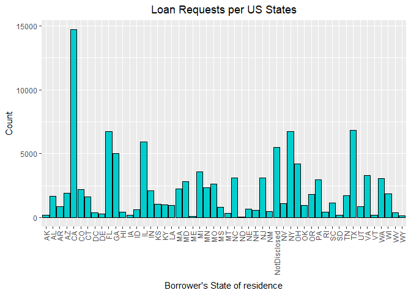
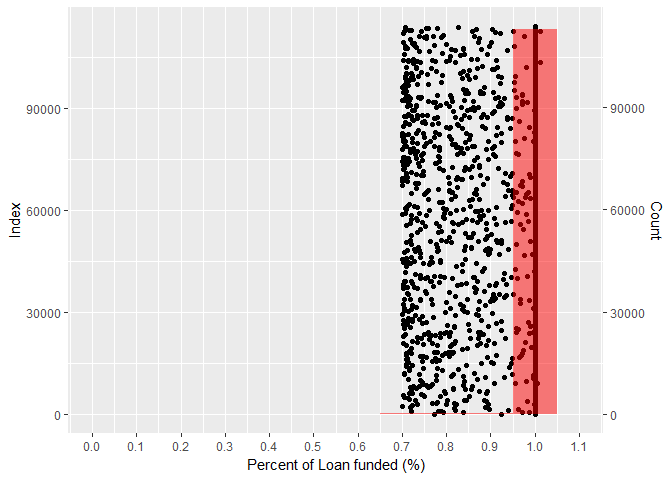
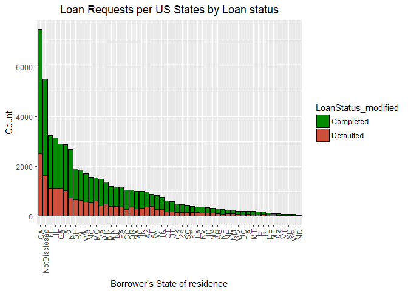
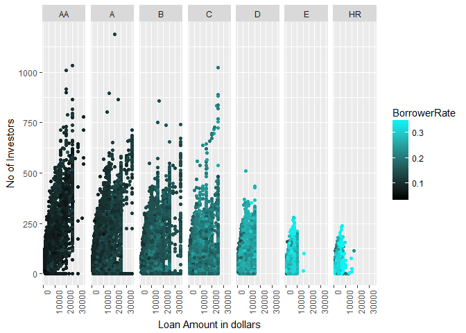

Explore and Summarize Loan Data from Prosper
================
Lakshmi\_Rajasekhar
December 10, 2017

-   ["Explore and Summarize Loan Data from Prosper" by Lakshmi Rajasekhar](#explore-and-summarize-loan-data-from-prosper-by-lakshmi-rajasekhar)
-   [Univariate Plots Section](#univariate-plots-section)
    -   [**Monthly Loan Listings (ListingCreationDate)**](#monthly-loan-listings-listingcreationdate)
        -   [Timeseries visual analysis](#timeseries-visual-analysis)
    -   [**Loan 'Term' ** (length of loan period requested by borrowers)](#loan-term-length-of-loan-period-requested-by-borrowers)
    -   [**Original Loan Amount (LoanOriginalAmount)**](#original-loan-amount-loanoriginalamount)
    -   [**Status of the Loan (LoanStatus)**](#status-of-the-loan-loanstatus)
    -   [**Borrower Interest Rate** (BorrowerRate)](#borrower-interest-rate-borrowerrate)
    -   [**BorrowerAPR**](#borrowerapr)
    -   [**LenderYield**](#lenderyield)
    -   [**BorrowerState**](#borrowerstate)
    -   [**ProsperRating (alpha)**](#prosperrating-alpha)
    -   [**ListingCategory**](#listingcategory)
    -   [**Employment Status**](#employment-status)
    -   [**CreditScoreRangeLower and CreditScoreRangeUpper**](#creditscorerangelower-and-creditscorerangeupper)
    -   [**Income Range**](#income-range)
-   [**Debt to Income Ratio**](#debt-to-income-ratio)
-   [**Total Prosper Loans**](#total-prosper-loans)
    -   [**PercentFunded**](#percentfunded)
-   [Univariate Analysis](#univariate-analysis)
    -   [What is the structure of your dataset?](#what-is-the-structure-of-your-dataset)
    -   [What is/are the main feature(s) of interest in your dataset?](#what-isare-the-main-features-of-interest-in-your-dataset)
    -   [What other features in the dataset do you think will help support your
        investigation into your feature(s) of interest?](#what-other-features-in-the-dataset-do-you-think-will-help-support-your-investigation-into-your-features-of-interest)
    -   [Did you create any new variables from existing variables in the dataset?](#did-you-create-any-new-variables-from-existing-variables-in-the-dataset)
    -   [Of the features you investigated, were there any unusual distributions?
        Did you perform any operations on the data to tidy, adjust, or change the form
        of the data? If so, why did you do this?](#of-the-features-you-investigated-were-there-any-unusual-distributions-did-you-perform-any-operations-on-the-data-to-tidy-adjust-or-change-the-form-of-the-data-if-so-why-did-you-do-this)
-   [Bivariate Plots Section](#bivariate-plots-section)
    -   [**Yearly Distribution of Loan Listings by Borrower State**](#yearly-distribution-of-loan-listings-by-borrower-state)
    -   [**Loan Term vs LoanOriginalAmount**](#loan-term-vs-loanoriginalamount)
    -   [**Term vs BorrowerRate**](#term-vs-borrowerrate)
    -   [**LoanStatus vs ProsperRating**](#loanstatus-vs-prosperrating)
    -   [**LoanStatus and ProsperRating**](#loanstatus-and-prosperrating)
    -   [**LoanOriginalAmount and ProsperRating**](#loanoriginalamount-and-prosperrating)
    -   [**IncomeRange and ProsperRating**](#incomerange-and-prosperrating)
    -   [**EstimatedReturn and ProsperRating**](#estimatedreturn-and-prosperrating)
    -   [**BorrowerState vs LoanStatus**](#borrowerstate-vs-loanstatus)
    -   [**BorrowerRate vs other variables**](#borrowerrate-vs-other-variables)
        -   [**BorrowerRate vs ProsperRating**](#borrowerrate-vs-prosperrating)
        -   [**BorrowerRate and LoanOriginalAmount**](#borrowerrate-and-loanoriginalamount)
        -   [**Investors and TotalProsperLoans**](#investors-and-totalprosperloans)
        -   [**ListingCreationDate and LoanOriginationDate**](#listingcreationdate-and-loanoriginationdate)
-   [Bivariate Analysis](#bivariate-analysis)
    -   [Talk about some of the relationships you observed in this part of the
        investigation. How did the feature(s) of interest vary with other features in
        the dataset?](#talk-about-some-of-the-relationships-you-observed-in-this-part-of-the-investigation.-how-did-the-features-of-interest-vary-with-other-features-in-the-dataset)
    -   [Did you observe any interesting relationships between the other features
        (not the main feature(s) of interest)?](#did-you-observe-any-interesting-relationships-between-the-other-features-not-the-main-features-of-interest)
    -   [What was the strongest relationship you found?](#what-was-the-strongest-relationship-you-found)
-   [Multivariate Plots Section](#multivariate-plots-section)
    -   [**ProsperRating, Listing Creation Year and and Term**](#prosperrating-listing-creation-year-and-and-term)
        -   [**BorrowerRate, LoanOriginalAmount and ProsperRating**](#borrowerrate-loanoriginalamount-and-prosperrating)
        -   [**CreditScoreRangeUpper, TotalProsperLoans and ProsperRating/LoanOriginalAmount**](#creditscorerangeupper-totalprosperloans-and-prosperratingloanoriginalamount)
        -   [**EmploymentStatus, TotalProsperLoans and ProsperRating/IncomeVerifiable**](#employmentstatus-totalprosperloans-and-prosperratingincomeverifiable)
        -   [**CreditScoreRangeUpper vs BorrowerRate/ProsperRating**](#creditscorerangeupper-vs-borrowerrateprosperrating)
        -   [**CreditScoreRangeUpper vs BorrowerRate/ProsperRating/ListingCreationDate**](#creditscorerangeupper-vs-borrowerrateprosperratinglistingcreationdate)
        -   [**EstimatedReturn, LenderYield, ProsperRating**](#estimatedreturn-lenderyield-prosperrating)
        -   [**Classification model to predict Prosper rating**](#classification-model-to-predict-prosper-rating)
-   [Multivariate Analysis](#multivariate-analysis)
    -   [Talk about some of the relationships you observed in this part of the
        investigation. Were there features that strengthened each other in terms of
        looking at your feature(s) of interest?](#talk-about-some-of-the-relationships-you-observed-in-this-part-of-the-investigation.-were-there-features-that-strengthened-each-other-in-terms-of-looking-at-your-features-of-interest)
    -   [Were there any interesting or surprising interactions between features?](#were-there-any-interesting-or-surprising-interactions-between-features)
    -   [OPTIONAL: Did you create any models with your dataset? Discuss the
        strengths and limitations of your model.](#optional-did-you-create-any-models-with-your-dataset-discuss-the-strengths-and-limitations-of-your-model.)
-   [Final Plots and Summary](#final-plots-and-summary)
    -   [Plot One - Loan Listings per Month](#plot-one---loan-listings-per-month)
    -   [Description One](#description-one)
    -   [Plot Two - Variation in number of Investors with ProsperRating/BorrowerRate/TotalProsperLoans](#plot-two---variation-in-number-of-investors-with-prosperratingborrowerratetotalprosperloans)
    -   [Description Two](#description-two)
    -   [Plot Three](#plot-three)
    -   [Description Three](#description-three)
-   [Reflection](#reflection)
-   [References:](#references)

"Explore and Summarize Loan Data from Prosper" by Lakshmi Rajasekhar
====================================================================

Before exploring and analyzing any dataset, a little bit of background reading for acquiring just enough domain knowledge goes a long way in understanding the dataset better. Hence, to start with, I tried researching the word 'Prosper' online. 'Prosper' turns out to be America's first marketplace lending platform. It is a California-based company who acts as an intermediary in a peer-to-peer lending system. Both "Borrowers" and "Investors" can register with Prosper with mandatory background checks for borrowers. Prosper takes a cut from both "Borrowers" and "Investors" to generate revenue and keep its services active.
More specifically, Wikipedia \[1\] states, *"Prosper has a transaction-based business model, in which the company collects revenue by taking a fee on its customers' transactions. Borrowers who receive a loan, pay an origination fee of 1.00% to 5.00%, depending on the borrower's Prosper Rating, and investors pay a 1% annual servicing fee."*

To explore the Prosper Loan Dataset provided by Udacity, I read in the dataset into the R environement. I also converted the csv file into an 'RData' file to reduce the time taken to read in the datset for subsequent times.

The loan dataset has 81 attributes and 113937 observations. The dataset has the listing date and hence I intent to do a time-series analysis later on to analyze the effect/changes with time. The dataset contains loan listings from November 2005 to March 2014. According to Wikipedia \[1\], *Prosper operated a variable rate model based on auction for determining loan rate till 2009. From Dec 2009, Prosper introduced pre-fixing the loan rate based on various analysis. It would be interesting to look at the changes in behaviour (if any) for various attributes for both pre-2009 and post-2009 periods.*

Univariate Plots Section
========================

**Monthly Loan Listings (ListingCreationDate)**
-----------------------------------------------

First, I wanted to look at the overall monthly distribution of Prosper loan listings for each year. I aggregated the loan listings per month and plotted it (based on the ListingCreationDate attribute). After some tries, I realised that the plot was missing some months but was not showing explicitly in the plot. Hence, I created a new variable with month and year and merged it with the original dataset before plotting. This helped keep the timeline of each month and year intact and hence visualize better for missing months.

Examining the plot and the underlying data, the loan listings on 'Prosper' website suddenly fell in Oct 2008 with no listings in the period of Nov 2008 to Mar 2009. Something unusal must have happened during this period. After this 'no listing period', the count of loan listings started picking up only from Jul 2009.
A little research online showed that U.S. Securities and Exchange Commission (SEC) had imposed a temporary 6-months 'quiet period' for 'Prosper.com' where it could not broker new loans while SEC sorted out the legal aspects of the lending platform.
Until Dec 2009, Prosper operated a variable loan rate model where the lenders/borrowers determined the loan rate based on an auction-like mechanism. After Dec 2009, Prosper put forward a Prosper pre-set loan rate model with SEC. The plot does not seem to show any affect due to this in Dec 2009.
Also, we can notice a slump in loan listings around Nov-Dec 2012 where the new loan listings fell by approximately 50%. Another research online showed that Prosper again had some problem with SEC due to which the trust of people in the Prosper platform fell. But as can be seen from the plot above, Prosper regained public trust and the loan listings rebounded to new heights.
Another point to note is that the starting and ending months in the given data does not include all days and hence it would be good to ignore the actual loan listing counts for the starting and ending months'.

### Timeseries visual analysis

The above plot helps to see that the number of loan listings per month per year has a very good trend and perfect sesonality pattern. There seems to be perfect peaks and troughs in the seasonal pattern. Due to this, this dataset might perform well for predicting the future listings for Prosper by fitting a timeseries model. The trend prediction (and randomness) might be hard but sesonality looks perfect. Since the focus of this project is just to do exploratory data analysis, I would not be doing a timeseries model building in this project. My intention from this plot was to see if the data internally had seasonal and(or) trend patterns.

**Loan 'Term' ** (length of loan period requested by borrowers)
---------------------------------------------------------------

    ## Summary of Term:
    ## 12months, 36months, 60months
    ##  1614 87778 24545

As can be seen from the figure above, 'Prosper' seems to offer only three options for a 'Term', namely, 1 year, 3 years and 5 years. out of these, 3 years seems to be the most popular 'Term' opted by the Borrowers. About 77% of the loan listings had Term as 36 months or 3 years. Later on, I would like to see if the loan amount requested also has an impact on the 'Term' chosen (most naturally, I expect there to be a good relationship). It looks unusual to see such low counts for 12 months 'Term'. I expected this number to be higher atleast for smaller loan amounts. This shows that people usually do not prefer short period loans even for smaller loan amounts. It might be related to the loan interest rates or some factor which might be affecting the Borrower's sense of utility for a 12 months term.

**Original Loan Amount (LoanOriginalAmount)**
---------------------------------------------

    ## Range of loan amounts requested: 1000 35000

    ## 
    ## Summary statistics of this variable is:

    ##    Min. 1st Qu.  Median    Mean 3rd Qu.    Max. 
    ##    1000    4000    6500    8337   12000   35000

The next variable which I wanted to look at is the variation in the Loan Amount requested. The range of the loan amount varied from 1000 to 35000 dollars. Based on the plot, for amount less than 15000, people seems to be borrowing all combinations of amounts. As loan amount requested increases, the density of the requests decreases, as well as, people seems to be requesting rounded-off values resulting in clear-cut lines.
To the naked eye, the plot seems to be divided into three varying density area. The most number of listings happens for loan amount &lt;= 15000. The next demand seems to be for loan amount in the range of (1500, 25000\]. The least demand (least dense area) seems to be for loan amount in the range (25000, 35000\]. To confirm, I looked at the counts and proportion of listings in each of there three regions.

    ##   Amount.range..in.dollars. Proportion.of.total.listings
    ## 1                  <= 15000                         ~90%
    ## 2             15000 - 25000                          ~9%
    ## 3             25000 - 35000                          <1%

From the available data, 90 percent of the requests came for amount less than ≤ 15000 dollars. About 9 percent of the requests were for amounts in the range of 15000-25000. Only 0.5 percent of requests came for amount &gt; 25000.
I also overlay a boxplot on top of the point plot to see where 50% of our data is located. The boxplot and calculating quantiles shows that 50% of the total Borrowers requested loans in the range of $4000-$12000.

**Status of the Loan (LoanStatus)**
-----------------------------------

    ## Unique levels in Loan Status variables are:

    ##  [1] Completed              Current                Past Due (1-15 days)  
    ##  [4] Defaulted              Chargedoff             Past Due (16-30 days) 
    ##  [7] Cancelled              Past Due (61-90 days)  Past Due (31-60 days) 
    ## [10] Past Due (91-120 days) FinalPaymentInProgress Past Due (>120 days)  
    ## 12 Levels: Cancelled Chargedoff Completed Current ... Past Due (91-120 days)

The 'Loan Status' is described using various terminology as can be seen from the graph above. To make proper conclusions, I looked up the Prosper website for meanings. 'Chargedoff' means a borrower is late on payment by 121 days. As far as I could figure out, a 'chargeoff' might be classified as defaulted later on. I could not find much about the 'FinalPaymentInProgress' terminology also. Logically, I think it might be payments made by the borrower after defaulting/Pastdue. Otherwise, I do not see why Prosper has to classify it separately. But for now, I am assuming it as part of "Completed" level.
I think it would make more sense to combine 'Chargedoff', 'Defaulted', and all levels with Past-Due (by x days) as one single level called 'Defaulted\_Total' and create a modified 'LoanStatus' attribute called 'LoanStatus\_modified'.

    ## Summary of modified 'LoanStatus' attribute statistics:

    ## Defaulted Completed   Current 
    ##     19082     38279     56576

Based on the above plot and the proportion calculations, for this dataset, 33 percent of people paid-off their loans on time. About 17 percent of people defaulted on their loans in some way or the other. Considering the defaulted count and the total loan 'Current', about 34 percent of the total 'Current' loan listings have a potential to become 'Defaulted' later on. This is huge!

**Borrower Interest Rate** (BorrowerRate)
-----------------------------------------

    ## geom_path: na.rm = FALSE
    ## stat_bin: na.rm = FALSE, binwidth = 0.01, pad = TRUE
    ## position_identity

The above plot looks interesting. I was playing around with different binwidths and the distribution looks positively skewed in general with some exceptional peaks. People with very low interest rates as well as very high interest rates are very less in number. I am assuming this to be related to the loan amount requested and the term months. More of this during the bivariate exploration. Also, the range of interest rates is from 0 - 0.4975. Zero interest rate is very unusual but I am guessing it would have been for very small loan amounts and the Borrower might have paid it off on-time or before the term ended.
But one important thing I want to check right now is the effect on 'Prosper Business model' change during 2009. Since this happened around December 2009, I will seperate the data out for pre-2010 and post 2010 data.

    ## Range of interest rates:

    ## For pre2010 timeperiod:  0 0.4975

    ## For post2010 time-period:  0.04 0.36

    ## geom_path: na.rm = FALSE
    ## stat_bin: na.rm = FALSE, binwidth = 0.01, pad = TRUE
    ## position_identity

    ## geom_path: na.rm = FALSE
    ## stat_bin: na.rm = FALSE, binwidth = 0.01, pad = TRUE
    ## position_identity

When I made the pre2010 and post2010 plots for BorrowerRate, I was assuming the post-2010 to be more normally distributed than pre-2010 as I thought Prosper might be fixing the interest rates in a normally distributed manner. Here, from the above plots, the pre-2010 interest rates look more normally distributed although both have a slight right skew. Interestingly, for both the plots, there are few unexceptionally high frequencies for certain higher interest rates. I would need to look more closely to determine what factors affect the higher interest rate. The range of the interest rates remain the same for pre2010 period but shrinks a bit in the post2010 period to (0.04 - 0.36). One thing to note here is that the count of records for both pre2010 and post2010 are very different. Hence, I would like to superimpose the histograms to get a better picture and confirm my thoughts given above.

Ironically, the superimposed histogram above shows that both pre and post 2010 periods have almost the same distribution. The difference in view earlier could have been due to the difference in the number of records for each category which affects the final frequency. The mean rates are also pretty close to each other.

**BorrowerAPR**
---------------

After seeing the BorrowerRate histograms, I wanted to see the same comparison of pre and post 2010 for Borrrower Annual Percentage Rate (APR).

    ## Range of BorrowerAPR for pre and post 2010 periods:

    ## For pre2010 timeperiod:  0.00653 0.51229

    ## For post2010 timeperiod:  0.04935 0.42395

As can be seen from the plot above, BorrowerAPR also more or less follows the same kind of distribution for pre and post2010. I do find a slightly lesser skew for the post2010 period (also confirmed by the mean vertical lines). I can see the same kind of 'exceptionally higher frequencies' for some of the higher APRs. BorrowerRate and BorrowerAPR histograms looks almost the same with x-axis ranges or values shifted a bit. Consequently, I wanted to find the relationship between an interest rate and APR. Prosper website makes the following point - *"Annual Percentage Rate (APR) is the cost of credit as a yearly rate. The APR figures in not just your interest rate, but also some fees associated with your loan over its lifetime."* Hence it is normal for the APR to be higher than the intrest rate as it is a derived field from interest rate. This can be confirmed by seeing the correlation coefficient of the two variables.

    ## Correlation coefficient between BorrowerAPR and BorrowerRate is:  0.989824

The correlation coefficient for "BorrowerRate" and "BorrowerAPR" is 0.989824. Hence, BorrowerAPR is indeed calculated from BorrowerRate. Thus any prediction/modelling analysis, if required, would only need one of these variable to account for removal of multi-collinearity.

**LenderYield**
---------------

Since I analyzed BorrowerRate and BorrowerAPR, I also wanted to see the LenderYield variable to get a complete picture. The data variable abbreviation states that lender yield is equal to the interest rate on the loan minus the Prosper service fee.

    ## Correlation coefficient between LenderYield and BorrowerRate is:  0.9992113

As expected, the correlation between BorrowerRate and LenderYield is 0.9992113. The histogram plot also confirms the same thing. But what I found interesting from analyzing the lenderYield variable is that for pre2010 period, for very few cases the LenderYield had been negative! Which means the lender was a loss in the investment. For pre2010, the rates were fixed by players (Borrowers and Investors) in an auction like way. Hence, if the investor is not careful especially for the lower loan amounts, after paying the service fee, the lender may actually end up loosing money! This doesn't seem to happen post2010 period when the interest rate is fixed by Prosper.

**BorrowerState**
-----------------

A look at the Borrower's State listed shows 52 unique values. Since, Prosper is operating the peer-to-peer lending platform in the United States, I expected it to have only 50 different abbreviations for the States but the data shows 52 different levels. A closer look revealed that there are blank values which R did not read in as NA values. I converted those values as 'NotDisclosed'. Also, I am assuming 'DC' stands for the federal district 'District of Columbia' or Washington D. C., which is th capital of United States. Now, that the confusion regarding 52 different levels are sorted out, I wanted to see which States have higher than usual loan requests.
The plot above shows that the State of California has the highest listings. There could be many reasons for this. First, Prosper is company located in the State of California. Hence, the trust in Prosper might be higher in California. Second, California is an expensive place to live in and hence, the money requirements of people to meet ends might also be higher due to higher cost of living. **A third and the most important thing is, the above plot is for the entire duration of the data. A further split of the plot based on year might give us a better picture about which states have higher listing.** Without the time component, the conclusions from this graph might be erronous as it would have taken time for popularity of Prosper to reach all the States. It might be wrong to assume that from Day 01, Prosper began operating in all the States!
Although the time component is required to make correct conclusions (I would be doing this in the Bivariate plot section), I would further like to extend the above plot to see a sorted count and the mean count of loan listings.

    ## Warning: package 'bindrcpp' was built under R version 3.3.3

    ## Proportion of California listing to total:  0.1291679

As can be seen fro mthe plot above, Prosper gets a lot of loan requests from California, followed by States like Texas, New York, Florida etc. Almost 13 percent of the total listings are from the State of California alone. Looking at the plot above, I think it is safe to assume that Prosper gets higher loan requests from states with a higher cost of living. Most of the states which are not that developed and hence would have lower cost of living have lower than the mean count of loan listing. One more thing I noticed is that there are very few listings from 'Washington D. C.'. One of the major reasons could be that being the capital city, not many people actually live in the D.C. area. Most of the residential areas for people who work in D.C. area is Northern Virginia and hence the Borrower State would be listed as 'Virginia' and not 'D.C.'. Other factors that could greatly affect the count of listings by State is the population density and area of the State which is not considered in the above plot. Also, a lot of people have not disclosed their state. Since, this count is a significant number, it could alter the final counts by State greatly. I plan to take up this plot again in the bivariate plot section to see how counts by State is affected by other attributes available so that we can make better conclusions from this graph. At this point, a lot of conclusions made from this graph are based on assumptions.

**ProsperRating (alpha)**
-------------------------

ProsperRating is a post2009 change by Prosper. Analyzing this variable would help in determining the frequent loan category people choose. Ratings are given from "AA" to "HR" based on risk with "AA" being the safest.

    ## Distribution of loan counts based on rating:

    ##    AA     A     B     C     D     E    HR 
    ##  5372 14551 15581 18345 14274  9795  6935

After reading Prosper website, I understood that lower risk doesn't necessarily mean loan amount being low. Propser lists a table between 'Term' and 'ProsperRating' available to choose from. Since lower risk doesn't mean lower loan amount, the above plot confirms the human psychology to choose an intermediate risk level. As can be seen from the barplot above, people's choice of risk for their investment also follows a normal distribution with majority of the poeple choosing an intermediate risk level 'C'.

**ListingCategory**
-------------------

ListingCategory would be good variable to look at to understand why most borrowers borrow money.

As can be seen from the plot above, most people use Prosper loans for 'Debt Consolidation' followed by for "Taxes", "Large Purchases" and "Green Loans". A significant number of people do not disclose why they are taking the loan for, which could actually affect the final numbers assuming the borrowers are disclosing truthfully. But the main thing we can conclude from this graph is that most of the people take loans for debt consolidation. It would be interesting to see how this varies with Borrower's income range, employement type etc.

**Employment Status**
---------------------

I think employment status would also be a good variable to look at to see if anything stands out.

Looking at the plot above, I would combine "Employed", "Self-Employed", "Part-time" and "Full-time" into a single "Employed" category. Also, I combined "Not available", "" and "Other" into "Not available" category. I also combined "Retired" and "Not employed" to "Not employed" category although not really appropriate.

The above plot and count proportions show that ~89% of the total listings were from "Employed" people. Now I do not think the needs of unemployed are less than that of employed category of people. What I believe is happening is that since Prosper verifies the background of borrowers, most unemployed Borrowers might not be even able to sign themselves up. Being unemployed also raises the risk of non-payment of loan.

**CreditScoreRangeLower and CreditScoreRangeUpper**
---------------------------------------------------

I wanted to see the variation in the credit score ranges. So the first thing that I did was to plot the histograms for both the variables.

The histograms show that the variables have the exact same distribution with a very long left tail. Taking a closer look reveals that the long left tail is due to few cases having CreditScore Range 0 and 19 for CreditScoreRangeLower and CreditScoreRangeUpper respectively. It would be interesting to see why these few cases have a 0-19 range. Another interesting thing I noticed is, the overall credit range (CreditScoreRangeUpper - CreditScoreRangeLower) is always a constant of 19. This indicates that CreditScoreRangeLower is perfectly correlated with CreditScoreRangeUpper.

**Income Range**
----------------

Income range would be good to look at to understand which income ranges borrow the most. There are 8 unique income ranges defined but I think the range saying '$0' should be classified as "Not Employed". After re-levelling the factor levels, I did a barplot of the "IncomeRange" variable as shown below.

This looks interesting to me as we can see that fewer 'very high income ranges' are in Prosper Borrower's list. The reason could be because of the maximum loan amount imposed by Prosper ($35k). Hence, very high income range people would not need Prosper's platform. Very low income Borrower's might not pass Prosper's background checks. Hence, most people who actually borrow through Prosper are the mid-income group. For them, Prosper's platform might be giving the flexibility and convenience for borrowing money.

**Debt to Income Ratio**
========================

Prosper keeps a cap on Debt to Income Ratio at 10.01. Hence people who requested loans for amount more than 10.01 times their income were only lent a maximum of 10.01 times their income. We can see few people who had their loans capped. Majority of the Borrowers seems to request an amount within their income range.

**Total Prosper Loans**
=======================

Total Prosper loans gives us an idea about the total number of prior Prosper loans the Borrower had. As per variable abbreviations, the value will be NA if the Borrower did not have any prior loans. After converting all NAs to 0, I decided to create a violin plot with gitter to visualise the density. The plot shows that the maximum number of existing loans at the time the new loan listing was made is equal to 8. The barplot above shows that majority of the people are either new with Prosper or have completed any prior loans with Prosper before requesting for new loans. It would be interesting to compare this variable with other factors like delinquency status of prior listings etc. More on this in the bivariate section.

**PercentFunded**
-----------------

The percentage the loan was funded shows us an idea of the risk associated by investors

I superimposed a dot plot with histogram to see how much percentage of each loan listing is actually funded. A quick proportion calculation revealed that more than 99 percent of the loans listed in Prosper are funded fully. I also found three cases where the loan was funded more than 100 percent! Unsual! The rest (less than 1 percent) of the loans are funded in the range \[0.7-1). This means that every loan listed in Prosper is atleast 70 percent funded! This is good news for the borrowers.

Since most loans are 100 percent funded, it is difficult to see the distribution of loans funded less than 100 percent. To visualise this, I subsetted and plotted the data for loans with less than 100 percent funding only as shown above. Interestingly, it follows a reverse count histogram than expected. The plot indicates that if a project is not funded fully, it is more likely to be funded only 70 or 80 percent and less likely to be funded 90 percent.

Univariate Analysis
===================

### What is the structure of your dataset?

ANS: The loan dataset has 81 attributes and 113937 observations. Each record in the dataset stands for a Prosper loan listing from 9th November 2005 to 10th March 2014.

### What is/are the main feature(s) of interest in your dataset?

ANS: Analyzing each variable thoroughly and do a demand forecasting for Prosper would be interesting but since that is not the focus of this project, I would be concentrating on the following features in this exploratory data analysis study:
1. ListingCreationDate
2. Term
3. LoanOriginalAmount
4. LoanStatus
5. BorrowerRate
6. BorrowerAPR
7. LenderYield
8. BorrowerState
9. ProsperRating..Alpha.
10. ListingCategory
11. EmploymentStatus
12. CreditScoreRangeLower
13. CreditScoreRangeUpper
14. IncomeRange
15. DebtToIncomeRatio
16. TotalProsperLoans
17. PercentFunded

### What other features in the dataset do you think will help support your
investigation into your feature(s) of interest?

ANS: Some other features in the dataset which might help this exploratory study are the financial attributes like LP\_ServiceFee, LP\_GrossPrincipalLoss etc. It would be interesting to see how these variables are related with each other (I am expecting very high correlation between most of these variables) as well as how these variables affect the loan 'Term', amount etc requested by the Borrower. It would also be interesting to see how these variables affect if an investor will invest in a listing or not.
But due to lack of time and the alredy long list of attributes considered, I do not plan to include these extra attributes in this exploratory study.

### Did you create any new variables from existing variables in the dataset?

ANS: Yes I did create some variables during the univariate plots. I plan to create new variables as and when I feel necessary for any further anaylysis. Few examples of features I created during univariate analysis are:
1. I created a 'LoanStatus\_modified' variable by combining certain levels like "Defaulted", "ChargedOff" and "Past\_due\_xxx". I kept the original variable as such as I did not want to lose the detailed information. At the same time, I wanted to just see the total number of loans which were defaulted and which were paid-back.
2. A temporary variable for year-month from the ListingCreatingDate so that I could analyze the monthly loan counts. This helped me determine which exact months had missing data and discover the 'quiet period' debacle in Prosper's history.
3. BorrowerRate\_pre2010, BorrowerRate\_post2010, BorrowerAPR\_pre2010, BorrowerAPR\_post2010 to analyze the BorrowerRate and BorrowerAPR respectively for both pre and post 2010 period to represent before/after quiet period.

### Of the features you investigated, were there any unusual distributions?
Did you perform any operations on the data to tidy, adjust, or change the form
of the data? If so, why did you do this?

ANS: Yes, I found many unusual patterns and/or distributions. Some examples are:
1. While plotting the listing count for each month and year, I noticed the sudden drop and 'no listing' period around 2009 - 2010. Researching online about any issues during this period revealed the forced Prosper 'quiet-period'.
2. There is unusally low count for 12-month loan term. Why is it that people do not prefer a 12-month loan term even for smaller loan amounts. I plan to investigate further on this during the bivariate/multivariate analysis.
3. BorrowerRate, BorrowerAPR, LenderYield (related variables) seems to have unusally higher counts for a certain bin of higher rate. I need to see further what is affecting this behaviour.
4. While analyzing the PercentFunded attribute, it was unusual to see that if a project is not funded 100 percent, it is more likely to be funded only 70 percent than around 90 percent. I would need to investigate further about what is causing this.

Tidying Data:
1. I sometimes aggregated levels in factor attributes to visually analyse the attribute better. E.g., levels in LoanStatus, EmploymentStatus, IncomeRange.
2. I also converted some of the missing levels to NAs like for ProsperRating (alpha). I sometimes renamed the missing data level "" to something meaningful like "NotDisclosed" for the BorrowerState variable. TotalProsperLoans attribute labelled 0 prior prosper loans as NA. I converted this to 0 so that it becomes easier to visualise

Bivariate Plots Section
=======================

**Yearly Distribution of Loan Listings by Borrower State**
----------------------------------------------------------

My main motive to do this plot was to see the variation in demand per year per state. I also wanted to see if Prosper started its business in 2005 only in certain states and not over the whole of United States.

As can be observed from the plots, there certainly are some states which started Prosper transactions later. But majority of the sates show some numbers which means, the Prosper platform was open to the public in all the States and federal districts. Its demand in certain states are actually less. One unusal thing that I noted was certain states like North Dakota (ND), Maine (ME) and Iowa (IA) does not have any loan listing after 2009. So it might be that, their state policy would not have allowed borrowers to lend after Prosper introduced their new business model late in 2009.

**Loan Term vs LoanOriginalAmount**
-----------------------------------

A density violin plot helps to identify the discrete areas where count is concentrated. For 12 months, most of the loan amounts were very small. As loan amount requested increased, the loan term selected also increased which makes sense as one needs more time to pay of debts of higher amount. It is also intersting to see loan request concentrations around round number of amounts as people round their loan requirements while making a listing.

**Term vs BorrowerRate**
------------------------

As expected, the interest rates for 12-month term loans are lower than 36- and 60-months term. But still the means seems to be close together, especially the 36-months and 60-months term plots. Although, people take higher amount loans for longer terms, this is not always true. That could be the reason for the overlaps as seen from the plots above. The interest rates for smaller amount of loans taken for longer term would be less compared to the higher amount loan.

**LoanStatus vs ProsperRating**
-------------------------------

I was interested only in the completed/defaulted cases from LoanStatus. The Prosper rating had some records without rating listed (pre2009 records) which were also removed from this plot. As can be seen, the defaulted cases increases as we move from category "A" to "E" for similar loan listing counts. What stands out unusual to me is that the number of listings in the "D" category is very high compared to the others. Also, not many people go for requests in the very low risk (AA) category.

The above plot of Loan listings by year and Prosper Rating looks interesting to me. I have considered only statuses - "Completed" and "Defaulted" for the above plot. Late 2009 was the time, Prosper introduced major changes to its business model and put forward new platform strategies. As can be seen from the plots above, from 2009-2010, Prosper was picking up from the quiet-period and the consequent dip in activity (Prosper ratings were introduced in the new model. Hence counts shown for 2009 year is incomplete; it shows only the post quiet period counts). After the new Prosper platform was introduced, by 2010, things had stabilized and either the loan listing counts for a category went up or down. For example, counts for category "AA" dipped whereas counts for "D" increased enormously. Prosper gives rating to the loan "AA - HR" based on internal analysis. This also shows the dip in activity around 2013 when Prosper again had a problem with the government control agency US 'SEC'.

**LoanStatus and ProsperRating**
--------------------------------

This analysis is only done for filtered data where the loan status is either Defaulted or Completed.

The above plots show some interesting things. After Prosper was back in market after the quiet period, Prosper introduced the loan ratings. Interestingly, Prosper allowed only 36-months loans to start with fom 2009 - 2010. Then it introduced 12-months and 60-months loan terms from 2010 onwards for categories "AA", "A", "B" and "C". From 2011 onwards, Prosper introduced 12- and 60-months loan terms for caterogies "D" and "E". Till 2014 (for the dataset provided), Prosper did not introduce 12- and 60-months terms for "HR" category! I also checked the loan terms available pre-2009 period. They were 36-months. 60-months term loans does not exist till 2010.
All the plots shows an abrupt end for '12-months' loans in 2013. I figured out reading online documents about Prosper that Prosper stopped their 12-months term loans in 2013. Currently they offer only 36-months and 60-months term loans.
Due to the above reasons, the counts for 36-months term loans are naturally higher as 36-months loans have been available throughout the history of Prosper platform. On the otherhand, 12-months and 60-months term loans have not been in existence continuously in the Prosper platform. Hence, making a conclusion on people's preference for loan terms looking at this data would be erronous. More than borrowers' choice, it is about what Prosper had to offer at that period of time. As can be seen from the plots above, as soon as 60-months term loans were introduced in 2011, we can see the 36-month loans dipping and almost 50 percent people preferring 60-month term loans instead.
Even with this discovery, one of my questions still remain unanswered. That is, why is the loan listings for category "D" the highest. In other words, what factors/attributes contribute to this occurence.

**LoanOriginalAmount and ProsperRating**
----------------------------------------

This analysis is also done only for filtered data where the loan status is either Defaulted or Completed. My main motive is to find out why Category "D" was most popular category till around 2011.

It looks like for loan categories "D", "E" and "HR", the loan amount requested by majority of the borrowers is lower than the rest. The reason for popularity of loans in the Prosper Rating category "D" might be due to the fact that Prosper might be using the loan amount as one of the factors for classifying the loan into categories/ratings.

**IncomeRange and ProsperRating**
---------------------------------

Apart from loan amount, I wanted to find out some of the other features affecting the categorization by Prosper. I wanted to see if income range of the borrowers had any effect on the categorization.

From the jitter plot above, it looks like unemployed borrowers' loan requests are more likely to be placed in categories "D", "E" and "HR" than the rest. Also, borrower's with higher income range (esp. &gt;75,000$) are also more likely to be placed in category D. Hence, I feel, income range is most likely a part of the Prosper's categorization algorithm.

**EstimatedReturn and ProsperRating**
-------------------------------------

I also wanted to look at how EstimatedReturn varies for the various loan categories created by Prosper.

The above plot looks more intuitive with respect to the loan categorization. The estimated return increase accross the categories from AA to E. This might also be one of the reasons why most loans till 2011 fall under category D. There were certain policy changes made like the various "Terms" available under different categories, etc around 2011 which led to other categories gaining popularity.

**BorrowerState vs LoanStatus**
-------------------------------

My main motive for doing the above plot was to see if Borrowers from any specific state has more tendency to default than others. As I was only interested in the defaulted vs completed cases, I included only those levels in the plot. Unfortunately, nothing looks odd in the above plot. The number of defaulted cases seems proportional to the total loan listings in a State, which is natural.

**BorrowerRate vs other variables**
-----------------------------------

While doing the univariate analysis, I had noticed certain unusually high counts for certain borrower interest rates (around 0.3 percent). The distributions for BorrowerAPR and LenderYield are also same as they are derived fields. Hence, I would like to analyze BorrowerRate attribute with other variables to see if any of them is causing the unusally high listings with borrowerRate around 0.3.
Before deciding which variable to use, I just did a quick scatter plot matrix with some chosen variables so see how BorrowerRate relate to them.

After analyzing the above plot, I decided to analyse BorrowerRate with Prosperrating and LoanOriginalAmount.

### **BorrowerRate vs ProsperRating**

Some unuslaly high loan counts for borrower interest rate near 0,3 was found near univariate analysis. I wanted to find the reason for this and which attributes actually affect this. First, I wanted to find a more specific range of borrower interest rates for which the counts are high. Making a histogram with limits around borrower rate = 0.3 is as given below.

From the above plot, it looks like borrower rate around 0.32 is very common.

The pre2009 data would have Prosper rating as null/NA. Apart from that, the Prosper Rating seems to be highly related to the Borrower interest rate. If Prosper rates a borrower's request as 'HR (High Risk)', then the interest rate charged is likely to be higher than a loan request categorized as 'AA (Low risk)'. The jitter plot and boxplot of category "NA" basically shows the range of borrower interest rates in the pre-2009 period (before Prosper quiet period). The boxplot above shows how the loan listings are distributed based on the ProsperRating category (AA to HR). Around 0.32 interest rate, there are listings fom Prosper rating category "D", "E", and "HR". This does not give me the exact reason why there are unusually high counts near BorrowerRate 0.32. I converted the above plot into a density violin plot to see if anything unsual will stand out.

The above plot gives a much clearer picture about what is happening around borrower interest rate 0.32. The density concentration of interest rates around 0.32 for HR loan category together with contributions from categories "D" and "E" might be causing the higher than usual counts around 0.32 interest rate.

### **BorrowerRate and LoanOriginalAmount**

The above plot does not give an intuition about what is causing different borrower interest rates for same loan amount. Probably I have to introduce a third variable and see it's effect on the above two variables. I plan to do it as part of multi-variate analysis.

### **Investors and TotalProsperLoans**

The results from the above plot look logical. There would be more number of investors who would like to invest in borrowers who have lesser existing loans. Risk miniization is a natural tendency in humans and I did not find anything unusual here.

### **ListingCreationDate and LoanOriginationDate**

Interestingly, I found that there is another 'LoanOriginationDate' apart from the 'ListingCreationDate'. A little bit of analysis showed that 'LoanOriginationDate is actually when the loan listing changed status from 'listing' to current 'loan'. I thought it would be a good idea to find the number of days to fund a loan from these dates and analyze it.

Unlike what I expected, I do not see any relationship between ProsperRating and the number of days it took to fund a loan listing.

Looking more closely, most of the loan requests seems to be getting funded within a month's time (as can be seen from the below plot). There doesn't seem to be any pattern between the ProsperRating and the number of days it takes to fund a listing.

Bivariate Analysis
==================

### Talk about some of the relationships you observed in this part of the
investigation. How did the feature(s) of interest vary with other features in
the dataset?

ANS:
Some of the unsual relationships I observed are as follows:
1. A yearly loan listing by State revealed that certain states stopping trading in Propser platform after the late 2009 Prosper remodelling. Specifically, I found that there were no listings from states North Dakota (ND), Maine (ME) and Iowa (IA). Probably, these states banned Prosper.
2. While analyzing the closed loan cases (Default/Completed status), I found ProsperRating category "D" to have unusally high listings compared to others. I also found that not many people go for requests in the very low risk (AA) category.
3. Exploring loan listing dates by term for various prosper categories led to the discovery of how Prosper has been introducing 'Terms' for various categories. Proper did not allow all 'Terms' for all categories. Initially, Prosper had only 36-months term. Slowly they introduced 12-months and 60-months for categories "AA", "A", "B" and "C", and then for categories "D" and "E" in the successive years. It was also interesting to note that Prosper did not allow 12-month and 60-month 'Terms' for "HR" category at all (throughout the given dataset time period atleast)!
4. The next revelation was that Prosper stopped the 12-months loans in 2013 while analyzing the plots. Online research confirmed that Propser currently offer only 36-months and 60-months terms.
5. Prosper rating vs Employment status showed that unemployed borrowers' loan requests are more likely to be placed in categories "D", "E" and "HR" than the rest.
6. Prosper categories "D", "E" and "HR" had lower loan amounts requested than the other categories. This shows that loan amount requested is an important factor in Propser's classification algorithm for ratings.
7. Estimated returns looked directly proportional to the rating categories from AA - E (except HR). For instance, category "E" had a higher estimated return than category "AA".

There were many relationships that I had observed. The above points are the unusal ones other than the usual/expected observations detailed in the bivariate plots section.

### Did you observe any interesting relationships between the other features
(not the main feature(s) of interest)?

ANS:
I did add other features than what was considered during the univariate analysis to clearly understand the bivariate relationships. For example, I used "Estimated Return" against Prosper Ratings to see the general relationship between the two. It helped give an idea about the general distribution of estimated return for each category of Prosper rating.
I also made a "daysToFund" attribute in the data which denotes the total days it took to actually fund a loan (LoanOriginationDate - ListingCreationDate). I tried to see the relationship between Prosper ratings and daysToFund. Although I did not find any notable pattern in bivariate, it still looks promising for multivariate analysis to see how the number of days to fund a loan listing is related to other variables like Prosper ratings, borrower employement status, total prosper loans etc.

### What was the strongest relationship you found?

ANS:
It is difficult to point out one single strongest relationship. While analyzing the relationship between 'LoanStatus' and 'PropserRating', there were few observations which intrigued me. Excluding the 'Current' loans and including only the 'Defaulted'/'Completed' loans, I found that, the loan listings are unusally high for Prosper category "D" and very low for category "AA". Further analysis about 'why' lead to a lot of insights! E.g.,
1. The different strategies adopted by Prosper for 'Term' vs 'ProsperRatings'. For example, when they started different 'Term' options for various categories and why certain categories were popular etc.
2. How loan original amount varies with ProsperRating.
3. How income range varies with Prosper Ratings and why category "D" was the most sought after in the 'Defaulted'/'Completed' cases.
4. The relationship between Estimated Return and Propser Ratings and how it increases from "AA" to "E".

Multivariate Plots Section
==========================

**ProsperRating, Listing Creation Year and and Term**
-----------------------------------------------------

I wanted to see if analysing ProsperRating, Loan creation year and Term together would give a better insight into how various terms varied within each category by time.

The above graph makes a lot of sense. The above plot crealy shows the 'quiet period' and then the start of categoried loan model (AA - HR) by Prosper. One can also note that, pre-quiet period, Prosper offered only one term, i.e., 36-months. The colours give the term of the loan and hence also shows that category "HR" does not offer 12-month and 60-month loans. For the other categories (AA - E), we can see that 12-month loans are the least popular. Popularity of 60-month (5-years) loans seems to be catching up/overtaking the 36-month (3-years) loans especially for categories "B", "C" and "D" through the years.

### **BorrowerRate, LoanOriginalAmount and ProsperRating**

Adding PropserRating with the bivariate plot "BorrowerRate vs LoanOriginalAmount" from the previous section adds a lot of clarity to it. As can be seen from the plot, irrespecive of the loan amount, the 'BorrowerRate' seems to be divided into certain subsets. This tells us that 'BorrowerRate' is a factor used by Prosper in their category prediction algorithm. The overlapping suggests that there are other variables involved. Also, the 'BorrowerRate' seems to be increasing from categories AA to HR with Borrower interest rates highest for HR category. This also makes sense logically.

### **CreditScoreRangeUpper, TotalProsperLoans and ProsperRating/LoanOriginalAmount**

One thing that had been lingering in my mind since univariate analysis is, "Who gets to take more Prosper loans?" Is it based on credit scores as an intuitive choice? What about other variables like 'employment status'? I am choosing credit score upper limit as both lower and upper limit are related to each other. Hence, seeing relation with one would help us understand the relation with other also.

The above plot is also a lot insightful. First of all, the above plot proves that ProsperRating does depend on the credit scores. Request from borrowers with higher credit score values are categorized in the lower risk categories and request from borrowers with lower credit scores are categorized in the higher risk categories. This also makes a lot of intuitive sense.
Second, the number of prosper loans seems to be higher for the middle credit scores. The reason I guess is the following. The borrowers with higher credit scores are usually people who are good with managing their credits and hence would have paid off any previous loans before requesting for more. The plot shows that people with higher credit scores have lower number of Prosper loans. The borrowers with lower credit scores might be requesting but might not have been accepted by Prosper as it makes sense to limit the number of loans given to high risk customers. Hence, the borrowers with higher number of simultaneous Prosper loans seems to be the people in the mid-credit score category.
What stands out unusual from the plot for me is that for borrowers in the lowest two credit scores, the minimum loans held seems to be two. This suggests that since Prosper would approve only smaller loan amounts for the lower score borrowers, they might be making multiple loan requests. It would be good to analyze this point with respect to time to see when they make multiple requests. Immediately or after certain period of time?
As a continuation of the above analysis, I also did the plot w.r.t LoanOriginalAmount although intuitively I was expecting lower credit score borrowers to be only granted smaller loan amount.

Although clear-cut divide based on loan amount is not seen, it still does show the pattern that lower credit score borrowers get lower loan amounts than higher credit scores.

Before further analysis, I wanted to filter out the total data for credit scores &lt;=640 (the required data). Since I need this for the post-quiet period, I added that condition also for Prosper Rating. My intention is to find the unique number of borrowers. But the fact is, we do not have any unique identifier for the borrowers although it is possible to find using an intersection of multiple other attributes (like monthly income, state, etc). Since this would be a new investigation and as I did not want to go deeper into a new one, I am stopping with finding the potential number of borrowers who belong to this lower credit score range and who do multiple loan requests. The probable potential number of unique customers is as given below:

    ## Possible unique borrowers:  733

Looking closely at the filtered data, I also found out that, if a borrower requests for a loan again with existing open ones, his 'TotalProsperLoans' column is updated for all his listings. I also figured out from the data that the repeat loan requests are not on the same day and none of the lowest credit score borrowers had single loan requests (the minimum was two). Then I figured out that Prosper had attributes like 'TradesinLast6months' etc details specific to the above analysis. Since I hadn't included those attributes in my radar earlier, I am not going deeper into this analysis of how loan requests varies with time and if there is any interesting pattern within the existing customers' (borrowers') loan requests.

### **EmploymentStatus, TotalProsperLoans and ProsperRating/IncomeVerifiable**

Although I got good insights from the previous graph, I also wanted to see how TotalProsperLoans varies with EmploymentStatus.

As seen from the plot above, it looks like a borrower's chance of getting repeated loans approved by Prosper is more if they are 'employed' than 'un-employed'. Also, the trust in granting a loan by Prosper seems to be more for full-time employed than self-employed or part-time employed people. The borrowers in the 'Retired' category were less but still we can see that there was no discrimination between Retired, Self-Employed, Other employed categories for granting of subsequent Prosper loans. The only thing that stands out from this graph is that Employed people stand higher chance of getting subsequent loans from Prosper than unemployed people.
To get a more intuitive sense, I plotted the same graph w.r.t to IncomeVerifiable instead of ProsperRating.

This gives a lot of clarity into why self-employed people had lower consecutive loans than employed/full-time employed people. Prosper found it hard to verify the income of self-employed people. For the un-employed, there is nothing to verify as there is no income. Hence, since verifiyability of income for the self-employed is difficult, the trust for Prosper for granting consequent loans is also less for this category.
\#\#\# **Investors vs other variables**

#### **Investors vs TotalProsperLoans/BorrowerRate/ProsperRating**

I was trying to find what factors affect a person's decision to invest in requests where the borrower had already defaulted loans. Then I realised that there is no borrower based unique identifier in the data to do this. Then, I thought of seeing how investors decided to invest based on total prosper loans a borrower had.

As can be seen from the plot above, the total number of investors investing in loan requests falls drastically as the total prosper loans held by a borrower increases. Also, prosper rating seems to be directly proportional to the borrower interest rate charged. The plot also shows a decrease in the number of investors as prosper rating changes from lower risk categories to higher risk categories. This needn't be due to the risk factor alone. Propser grants only smaller amounts to high risk customers. Hence, proportionally, the number of investors required to fund that loan is also less.

#### **Investors vs EstimatedReturn/LenderYield**

The next analysis I performed was number of investors w.r.t 'Estimated Return' and 'Lender Yield'. Estimated return is calculated as Borrower interest rate minus all prosper service fees. As per my understanding, Lender yield is the actual returns a lender got from his investment on a loan. The above plot shows that the number of investors willing to invest in a loan drop with increase in estimated returns. This is counter-intuitive! Higher estimated returns also show higher actual lender yields. One reason I can think of is that the estimated returns is related to the borrower rate. Borrowe rate is higher for higher risk customers. Hence, the investors would not want to invest in loans with higher risk. Probably I have to compare the above results w.r.t Prosper Rating to get a more intuitive plot.
But what stands out to me is that some investors were willing to invest in loans which had negative estimated return! Also, some of these negative estimated return loans had positive lender yields. Maybe the investors were poeple who knew and trusted the borrowers. Perhaps that is the reason Prosper has attributes for "InvestmentFromFriends amount/count" in the dataset. Since this attribute was not part of the focus for this analysis, I do not plan to digress and do that analysis.

#### **Investors vs EstimatedReturn/LenderYield/ProsperRating**

The above plot is more intuitive than the previous plot. This shows that higher risk loans have higher returns but most investors play safe and choose lower risk loan categoris to invest. Other interesting thing from this graph is that the number of investors seems to be falling as estimated return increases for categories "AA", "A", and "B". Categories "C" and "D" seem to be in the middle where investors seems to be choosing loans with average estimated return values. There is a complete shift in categories "E" and "HR" where there are more investors for higher estimated returns. Maybe because, investors investing in higher risk loans are risk takers by nature. Hence, those investors always try to optimize and maximize their returns.

#### **Investors vs LoanOriginalAmount/BorrowerRate/ProsperRating**

The number of investors are less for higher risk loan categories. This could also be due to the fact that most higher risk loan categories have lower loan amounts granted. The plot also shows that within a given loan catgory, the number of investors is higher for higher loan amounts which also is intuitive.

#### **Investors vs PercentFunded/LoanOriginalAmount/ProsperRating**

From most of the above plot, it seems like investors divide the loan categories in two kinds - Lower risk("AA", "A", "B" and "C") and higher risk("D", "E", "HR"). There is a drastic decrease in the number of investors in these two types. Higher risk categories have lower loan amount and hence lower number of investors. What is not evident is why are some loans not funded fully within same categories? But what is evident is that for loans which are funded 100 percent, the range of the number of investors investing is very high! That means, even in fully funded similar loan amounts, some have been funded by a small set of investors in larger contributions whereas other have been funded by higher number of investors in smaller amounts

### **CreditScoreRangeUpper vs BorrowerRate/ProsperRating**

The above analysis was done to see how Prosper rating of loans varies with credit scores and borrower interest rates. As can be seen, more than the credit score, prosper rating depends on borrower interest rates. For the same credit score, a loan may be categoried as lower risk or higher risk based on borrower interest rate.

### **CreditScoreRangeUpper vs BorrowerRate/ProsperRating/ListingCreationDate**

This gives a bit more clarity than the previous plot. This shows how the loan listings vary based on borrower interest rate and credit score for each category of prosper rating. I also added the listing creation year. For HR category, there seems to be very less listing than what was there in 2010-2011. Also, for HR category, the borrower interest rate used to fluctuate a lot. But it seems to have stabilised around 0.3 for later years. This is just a raw analysis that I get by seeing the graph and I feel it should be investigated in detail.

### **EstimatedReturn, LenderYield, ProsperRating**

One last thing I was interested in seeing before closing the multi-variate analysis was how estimated return and lender yield vary w.r.t prosper rating. It is amazing to see that estimated return and lender yield are directly proportional if we break it down by prosper ratings. There are a lot of fluctations in the prosper rating category "HR" but other categories seems to be a lot stable. In fact, creating a new attribute as the difference between actual lender yield and estimated return rate would be good.

This is beautiful! There seems to be some unstability for the category "HR" around 2010-2011. But overall, it looks like, Prosper ultimately follows a simple classification algorithm to classify loans into different risk categoris based on the difference of lender yield and estimated return. Also, there doesn't seems to be overlaps between various loan categories based on return variation which is amazing. But the catch is, Estimated return is available at the time the listing is created and Propser assigns a rating to the listing. But, Lender Yield is arrived at only when the loan formally comes into origination! Not that deriving Lender Yield is difficult. But I suspect, Propser might be using Borrower rate (Lender yield is directly proportional to this) and Estimated return as major attributes for prediction as these are available at the time a listing is created. First, I repeated the above plot with BorrowerRate instead of Lender Yield to see if my assumption of using BorrowerRate to substitute for LenderYield is correct.

As can be seen from the plot above, using BorrowerRate is equivalent to LenderYield for achieveing the desired results. Performing a simple classification modelling would reveal if this insight is actually true.

### **Classification model to predict Prosper rating**

Although lender yield is not known, lender yield is calculated from Borrower interest rate which is calculated by a committee within Prosper and hence known at the time of listing. Hence, modelling a simple decision tree classification model using C5.0 algorithm.

I can derive lender yield but since I had not included the attributes dealing with Prosper fees, I decided to include borrower interest rate and estimated return directly with few other attributes like "LoanOriginalAmount", "Term", "CreditScoreRangeUpper", and "TotalProsperLoans" to predict the prosper rating attribute. I tried adding certain other attributes also, but the current set performed the best.

I performed stratified sampling to split into train and test to keep the proportion of records for each prosper loan category proportional in train and test splits.

Looking at the variable importance or how much a particular variable was used in the decision tree modelling, we have:

    ##                       Overall
    ## BorrowerRate           100.00
    ## EstimatedReturn        100.00
    ## Term                    89.52
    ## LoanOriginalAmount      69.10
    ## CreditScoreRangeUpper   44.94
    ## TotalProsperLoans        5.49

To visualize, plotting the whole decision tree would be a mess. Hence, I chose a portion of the tree created, just to get a feel for it.

Predicting on the test split and creating the confusion matrix to see how the tree performs:

    ## Confusion Matrix and Statistics
    ## 
    ##           Reference
    ## Prediction   AA    A    B    C    D    E   HR
    ##         AA 1605    6    0    0    0    0    0
    ##         A     6 4359    2    0    0    0    0
    ##         B     0    0 4664   15    0    0    0
    ##         C     0    0    8 5487    5    0    0
    ##         D     0    0    0    1 4277    0    0
    ##         E     0    0    0    0    0 2937    0
    ##         HR    0    0    0    0    0    1 2080
    ## 
    ## Overall Statistics
    ##                                           
    ##                Accuracy : 0.9983          
    ##                  95% CI : (0.9977, 0.9987)
    ##     No Information Rate : 0.2162          
    ##     P-Value [Acc > NIR] : < 2.2e-16       
    ##                                           
    ##                   Kappa : 0.9979          
    ##  Mcnemar's Test P-Value : NA              
    ## 
    ## Statistics by Class:
    ## 
    ##                      Class: AA Class: A Class: B Class: C Class: D Class: E
    ## Sensitivity            0.99628   0.9986   0.9979   0.9971   0.9988   0.9997
    ## Specificity            0.99975   0.9996   0.9993   0.9993   1.0000   1.0000
    ## Pos Pred Value         0.99628   0.9982   0.9968   0.9976   0.9998   1.0000
    ## Neg Pred Value         0.99975   0.9997   0.9995   0.9992   0.9998   1.0000
    ## Prevalence             0.06329   0.1715   0.1836   0.2162   0.1682   0.1154
    ## Detection Rate         0.06306   0.1713   0.1832   0.2156   0.1680   0.1154
    ## Detection Prevalence   0.06329   0.1716   0.1838   0.2161   0.1681   0.1154
    ## Balanced Accuracy      0.99801   0.9991   0.9986   0.9982   0.9994   0.9998
    ##                      Class: HR
    ## Sensitivity            1.00000
    ## Specificity            0.99996
    ## Pos Pred Value         0.99952
    ## Neg Pred Value         1.00000
    ## Prevalence             0.08172
    ## Detection Rate         0.08172
    ## Detection Prevalence   0.08176
    ## Balanced Accuracy      0.99998

As can be seen from the output above, the C5.0 decision tree model is predicting with 99.83 percent accuracy. Kappa value is also great and hence, I think, this would be a good model to mimic Prosper rating algorithm used by Prosper.

Multivariate Analysis
=====================

### Talk about some of the relationships you observed in this part of the
investigation. Were there features that strengthened each other in terms of
looking at your feature(s) of interest?

ANS:
There were a lot of interesting relationships that I found using multivariate analysis. Some of them are as given below:
1. Prosper rating vs Term and Listing Date: This plot reinforced the finding that 36-month loan term was the most used. One major reason is, Prosper offered only 36-months loan terms for majority of the timeline. 12-month loan terms are not popular at all but we can see 60-months loan term picking up after its introduction by Prosper. Hence, to decide on the popularity, we will have to compare 36-months and 60-months using succeeding years data.
2. Plot between attributes - BorrowerRate, LoanOriginalAmount and ProsperRating: This showed that Borrower interest rate indeed should be an important metric used by Prosper in classifying loan categories.
Also adding 'Total Prosper Loans' and 'Credit Score Range Upper' into the above plot to further analyze the plot, I found that both these attributes also might have a contribution to the prosper rating algorithm.
3. Plots between - EmploymentStatus, TotalProsperLoans and ProsperRating/IncomeVerifiable: Although Prosper rating categorization was not evident from these plots, employment status and income verifiability seems to be important attributes defining if a borrower would get multiple prosper loans or not. Specifically I found that, it is very difficult for un-employed borrowers to obtain more than 1-2 prosper loans simultaneously.
4. To figure out how investors decided to invest (based on the selected attributes only), I did a series of plots to see relationships and they were very insightful!
(a) Investors were less likely in invest in higher risk loan categories, especially, "E" and "HR". Also, investors were vary when the borrower had a higher interest rate or more than 1 existing proser loans. This is also psychologically logical.
(b) Investors/lenders did not just look at the estimated return stated by Prosper. Most tried to invest safe. The number of investors fall based on loan risk category and borrower interest rate more than estimated return.
5. As expected, borrower rate is dependent on credit scores. Credit scores also seems to be influencing Prosper loan rating.
6. The most meaningful insight I found is that 'EstimatedReturn' and 'LenderYield' drive Prosper loan categorization to a big extend! Since, Lender yield is not calculated at the time of listing creation and lender yield is calculated from borrower rate, borrower rate and estimated return affects prosper rating (as is evident from the plots also).
From the plots, it seems like Prosper took a while (till around 2013) to stabilise their Prosper rating categorization algorithm.

### Were there any interesting or surprising interactions between features?

ANS:
The most important insight I gained is about which variables affect Prosper rating classification. I found that "BorrowerRate" and "EstimatedReturn" influence prosper rating the most. Other variables with influence that I found were: "Term", "LoanOriginalAmount", "CreditScoreRangeUpper", and "TotalProsperLoans".

### OPTIONAL: Did you create any models with your dataset? Discuss the
strengths and limitations of your model.

ANS:
I created a simple C5.0 decision tree algorithm to predict Prosper rating using the following attributes: EstimatedReturn, BorrowerRate, Term, LoanOriginalAmount, CreditScoreRangeUpper, TotalProsperLoans. The model is predicting with 99.83 percent accuracy on the test split which seems to be pretty good!
**Strengths:** The model is simple and uses only limited features to keep the model complexity minimal. We can also explain the variable importance or contribution to the model building for the attributes selected.
**Possible Weakness:** I will have to explore all the variables listed in the dataset and their relationship with prosper rating to exactly figure out which ones to use. I currently looked at relationships only within the attributes chosen. This needn't be that much of a weakness as the prediction accuracy is pretty high for the model.
Also, testing on future data if available (from 2014 onwards) would help to decide more on the model applicability.

------------------------------------------------------------------------

Final Plots and Summary
=======================

### Plot One - Loan Listings per Month

### Description One

I chose "Loan Listings per Month" as the first plot as it gives a summary of loan listings per month per year for Prosper. It gives us an idea about how Prosper has been performing overall. It also highlights the breaks (quiet periods) which help us to further investigate to find the causes. It also shows some changes around early 2013 (maybe policy changes) after which Prosper listings shoot up! Overall, I feel this is a good plot to summarize how Prosper has been doing for the timeline given in the dataset.

### Plot Two - Variation in number of Investors with ProsperRating/BorrowerRate/TotalProsperLoans

### Description Two

I decided to choose the above plot as the second plot as it gives insight into how the number of investors vary with respect to borrower' interest rate, loan risk category given by Prosper and total prosper loans held by the borrowers. This gives an overall picture of where the investors/lenders decide to invest their money. It also gives borrowers a feel for their current standing based on their values for the factors under consideration.
According to the plot, the number of investors decrease as prosper rating changes from lower risk to higher risk loan category. The Borrower interest rate also seems to increase as we move from lower risk loan categories to higher risk loan categories. Also, within each loan risk category, as the number of total prosper loans held by a borrower increases, the number of investors willing to invest in that loan listing decreases.

### Plot Three

### Description Three

The above plot, although not based on actual features, gives a lot of insight into how Prosper might be performing the loan risk classification. The y-axis represents the difference in BorrowerRate and EstimatedReturn. As can be seen from the plot, there seems to be clear boundaries for each of loan risk categories. There were some instability till 2013, but after 2013, the ProsperRating algorithm seems to have stabilized indicating clear range of values of y-axis used for categorization. This helps us realise the simplicity Prosper might be using for classifying Prosper Rating as well as the two important attributes which might be affecting this classification.

------------------------------------------------------------------------

Reflection
==========

First of all, I found exploring this dataset not difficult but a lot time-consuming! Hence, I grossly underestimated the time I would need to finish this project. I also found sub-dividing univariate, bi-variate and multi-variate plots difficult to the flow of thoughts. For example, while performing some univariate plots, if I find an interesting relationship and hence need to add more attributes to analyze further, I would have to jump to bivariate or multi-variate plots to do the same. Rather, if this restriction was not kept, it would have been easier to continue with the flow of thoughts and finish one set of analysis before begining another. Nevertheless, it was a fullfilling experience! It also taught me a lot about peer-to-peer lending platforms which I did not know existed!
I still feel like I need to explore all the variables to get a complete picture of Prosper lending platform but since time is of essence, I did not do it. I also did not concentrate on different lines of approach. For example, with the variety of attributes given, one can concentrate on analyzing them from the point of view of Prosper, investors or borrowers. I did not use either of these approaches and tried to select certain attributes which I felt would give a better overall picture of this peer-to-peer business.
There are many attributes related to Prosper fee which would have been interesting to look at. Maybe, how I would plan a future study on this dataset would be classify the dataset given into three categories - attributes of interest to Prosper, investors, borrowers and then analyze them. This would have been complete! From the perspective of Prosper, it would help them gain insight into how to imporve their business. From Investors' perspective, it would give them insight into where to invest to maximize their returns and minimize losses. From the Borrowers' persepctive, it would help them decide on the term, loan amount etc to go with to get the maximum benefit at lowest extra cost.
I did refer to the style guide reference given by Udacity written by Dr. Hadley Wickham. I tried implementing almost all the guidelines except the following: Implementing assignments as "&lt;-" than "=". I did not use "&lt;-" as implementing this is very difficult when using multiple languages. I find using "=" itself as it gives us the flexibility accross various languages without confusion. Also, I found that the line length is less than 80 when one enforces index on the left side of the knitted html report. Hence, this was also kind of auto-taken care of.

References:
===========

1.  Proper wikipedia - <https://en.wikipedia.org/wiki/Prosper_Marketplace> *(last accessed: Dec 10, 2017)*
2.  Prosper Website - <https://www.prosper.com/plp/how-it-works/> *(last accessed: Dec 10, 2017)*
3.  Style guide - <http://adv-r.had.co.nz/Style.html> *(last accessed: Dec 25, 2017)*
4.  Ggplot color palatte - <http://sape.inf.usi.ch/quick-reference/ggplot2/colour> *(last accessed: Dec 25, 2017)*
